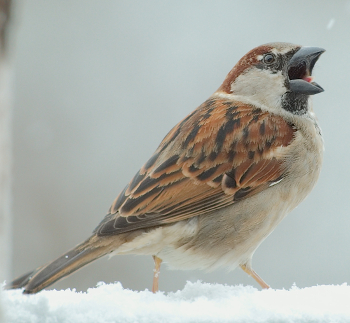
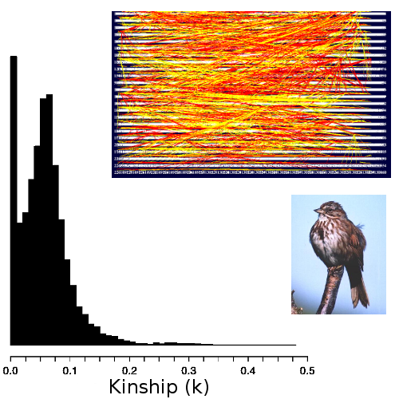

<style type="text/css">
body p {
  color: #000000;
}
ul {
  color: black;
}
ol {
  color: black;
}
a {
    color: darkblue;
    text-decoration: none
}
.fifty {
   font-size: 50%;
   }
.seventy {
   font-size: 70%;
   }
slides > slide.backdrop {
  background: none !important;
  background-color: white !important;
}
slides > slide.title-slide hgroup h1 {
  color: black;
}
slides > slide.title-slide p {
  color: black;
}
slides > slide.light > hgroup h2 {
  color: black;
}
slides > slide.light > hgroup h1 {
  color: black;
}
ul {
  color: black;
}
ol {
  color: black;
}
p {
  color: black
}
h1, h2, h3, h4, h5, h6, h7, h8, p {
    color: black;
}
.checkbox-inline, .radio-inline {
    margin-right: 90px;
}
.forceBreak { -webkit-column-break-after: always; break-after: column; }
</style>


```{r, echo = FALSE}
initialise_inds <- function(N = 200){
    ID      <- matrix(data = 0, nrow = N, ncol = 30);
    ID[,1]  <- 1:N;
    ID[,2]  <- rbinom(n = N, size = 1, prob = 0.5);
    ID[,3]  <- sample(x = 1:10, size = N, replace = TRUE);
    ID[,4]  <- sample(x = 1:10, size = N, replace = TRUE);
    ID[,5]  <- rep(x = 0, times = N);
    ID[,6]  <- rep(x = -1, times = N);
    ID[,7]  <- rep(x = -1, times = N);
    ID[,8]  <- rep(x = 0, times = N);
    ID[,9]  <- rep(x = -1, times = N);
    ID[,10] <- rep(x = 0, times = N);
    return(ID);
}

initialise_Rmat <- function(ID){
    rows <- dim(ID)[1];
    Rmat <- matrix(data = 0, nrow = rows, ncol = rows);
    diag(Rmat) <- 1;
    Rmat <- cbind(ID[,1], Rmat);
    return(Rmat);
}

Rbuild <- function(Rmat, ID, Rmat_new){
    inds <- dim(ID)[1];
    for(i in 1:inds){
        if(ID[i, 6] %in% Rmat[,1] == FALSE){
            MomP <- -1;
        }else{
            MomP <- which(Rmat[,1] == ID[i, 6]);
        }
        if(ID[i, 7] %in% Rmat[,1] == FALSE){
            DadP <- -1;
        }else{
            DadP <- which(Rmat[,1] == ID[i, 7]);
        }
        # Inbreeding coefficient
        if(MomP < 0 | DadP < 0){
            Rmat_new[i, i+1] <- 1; 
        }else{
            Rmat_new[i, i+1] <- 1 + Rmat[MomP, DadP+1]; 
        }
        # Kinship coefficient
        j <- 1;
        while(j < i){
            if(ID[j, 6] %in% Rmat[,1] == FALSE){
                Om <- -1;
            }else{
                Om <- which(Rmat[,1] == ID[j, 6]);
            }
            if(ID[j, 7] %in% Rmat[,1] == FALSE){
                Od <- -1;
            }else{
                Od <- which(Rmat[,1] == ID[j, 7]);
            }
            
            if(ID[i,5] == 0 & ID[j,5] == 0){
                if(Om < 0 | MomP < 0){
                    w <- 0;
                }else{
                    if(MomP == Om){
                        w <- 0.5 * Rmat[MomP, Om + 1];
                    }else{
                        w <- Rmat[MomP, Om + 1];
                    }
                }
                if(Od < 0 | MomP < 0){
                    y <- 0;
                }else{
                    y <- Rmat[MomP, Od + 1];
                }
                if(Om < 0 | DadP < 0){
                    x <- 0;
                }else{
                    x <- Rmat[DadP, Om + 1];
                }
                if(Od < 0 | DadP < 0){
                    z <- 0;
                }else{
                    if(DadP == Od){
                        z <- 0.5 * Rmat[DadP, Od + 1];
                    }else{
                        z <- Rmat[DadP, Od + 1];
                    }
                }
            }
            rMmuP <- 0.5 * (w + y);
            rDmuP <- 0.5 * (x + z);
            rval  <- 0.5 * (rMmuP + rDmuP);
            
            Rmat_new[i, j+1] <- rval;
            Rmat_new[j, i+1] <- rval;
            j <- j + 1;
        }
    }
    
    for(i in 1:inds){
        for(j in 1:inds){
            if(ID[i, 6] == ID[j, 1]){
                if(ID[j, 6] == -1){
                    Rmat_new[i, j+1] = 0.25;
                    Rmat_new[j, i+1] = 0.25;
                }    
            }
            if(ID[i, 7] == ID[j, 1]){
                if(ID[j, 7] == -1){
                    Rmat_new[i, j+1] = 0.25;
                    Rmat_new[j, i+1] = 0.25;
                }    
            }
        }
    }
    
    return(Rmat_new);
}

mateselect <- function(ID, Rmat_new){
    fem <- ID[ID[,2] == 0 & ID[,5] == 0,];
    mal <- ID[ID[,2] == 1 & ID[,5] == 0,];
    for(i in 1:dim(fem)[1]){
        strat <- sum(fem[i,11:20]);
        vals  <- rep(0, dim(mal)[1]);
        fpos  <- which(Rmat_new[,1] == i); 
        for(j in 1:length(vals)){
            mpos    <- which(Rmat_new[,1] == j);
            kval    <- Rmat_new[i, j+1];
            vals[j] <- kval * strat;
        }
        if(strat < 0){
            weight <- 1 / (1 + (-1 * vals));
            probs  <- weight / sum(weight);
        }else{
            weight <- 1 + vals;
            probs  <- weight / sum(weight);
        }
        mate    <- sample(x = 1:dim(mal)[1], size = 1, pr = probs);
        mateID  <- mal[mate,1];
        matepos <- which(ID[,1] == mateID);
        ownID   <- fem[i, 1];
        ownpos  <- which(ID[,1] == ownID);
        ID[ownpos, 9]  <- mateID;
        ID[matepos, 9] <- ownID;
    }
    return(ID);
}

make_offspring <- function(ID, Rmat_new, nn = 6){
    start_ID <- max(ID[,1]) + 1;
    for(i in 1:dim(ID)[1]){
        if(ID[i, 2] == 0 & ID[i, 9] > 0 & ID[i, 5] == 0){
            mum    <- ID[i,];
            dadpos <- which(ID[,1] == ID[i, 9]);
            dad    <- ID[dadpos,];
            offs   <- matrix(data = 0, nrow = nn, ncol = dim(ID)[2]);
            offs[,1] <- start_ID:(start_ID+nn-1);
            start_ID <- start_ID + nn;
            offs[,2] <- rbinom(n = nn, size = 1, prob = 0.5);
            offs[,3] <- mum[3];
            offs[,4] <- mum[4];
            offs[,6] <- mum[1];
            offs[,7] <- dad[1];
            mrpos    <- which(Rmat_new[,1] == mum[1]);
            drpos    <- which(Rmat_new[,1] == dad[1]);
            offs[,8] <- Rmat_new[mrpos, drpos+1];
            offs[,11:30] <- mum[11:30];
            dum_vec  <- rbinom(n = length(offs[,11:30]), size = 1, prob = 0.5);
            dummy    <- matrix(data = dum_vec, nrow = dim(offs)[1]);
            dummy[dummy > 0] <- NA;
            
        }
    }
}

produce_offs <- function(ID, Rmat_new, nn){
    # NOTE: This toy model has unrealistic recombination between parents!
    mums  <- sum(ID[,2] == 0 & ID[, 5] == 0 & ID[, 9] != 0);
    offs  <- matrix(data = 0, nrow = mums * nn, ncol = dim(ID)[2]);
    start <- 1;
    for(i in 1:dim(ID)[1]){  # Unrealistic recombination saves some time.
        if(ID[i,2] == 0 & ID[i, 5] == 0 & ID[i, 9] != 0){
            her_off     <- matrix(data = ID[i,], nrow = nn, ncol = dim(ID)[2], 
                                  byrow = TRUE);
            her_off[,2] <- rbinom(n = nn, size = 1, prob = 0.5);
            her_off[,6] <- ID[i,1];
            her_off[,7] <- ID[i,9];
            mum_p       <- which(Rmat_new[,1] == ID[i,1]);
            dad_p       <- which(Rmat_new[,1] == ID[i,9]);
            her_off[,8] <- Rmat_new[mum_p, dad_p + 1];
            her_off[,9] <- -1;
            dad_o       <- which(ID[,1] == ID[i,9]);
            dad_overlay <- matrix(data = ID[dad_o,], nrow = nn, 
                                  ncol = dim(ID)[2], byrow = TRUE);
            to_vec      <- rbinom(n = nn*dim(ID)[2], size = 1, prob = 0.5);
            to_overlay  <- matrix(data = to_vec, nrow = nn);
            to_overlay[,1:10] <- 1;
            her_off[to_overlay < 1] <- NA;
            her_off[is.na(her_off)] <- dad_overlay[is.na(her_off)];
            offs[start:(start+(nn-1)), 1:dim(ID)[2]] <- her_off;
            start <- start + nn;
        }
    }
    max_ID   <- max(ID[,1]);
    offs[,1] <- (max_ID + 1):(max_ID + dim(offs)[1]); 
    return(offs);
}

mortality <- function(offs, beta){
    depression        <- exp(-1 * beta * offs[,8]);
    alive             <- rbinom(n = dim(offs)[1], size = 1, prob = depression);
    offs[alive < 1,5] <- -1;
    offs              <- offs[offs[,5] > -1,];
    return(offs);
}

mutation  <- function(offs, mu){
    mutations <- rbinom(n = 20*dim(offs)[1], size = 1, prob = mu);
    tot_mut   <- sum(mutations);
    mut_mat   <- matrix(data = mutations, nrow = dim(offs)[1]);
    mu_eff    <- rnorm(n = tot_mut, mean = 0, sd = 2);
    mut_mat[mut_mat > 0] <- mu_eff;
    offs[,11:30] <- offs[,11:30] + mut_mat;
    return(offs);
}

retain <- function(ID, offs){
    retainers <- rep(x = 0, times = dim(ID)[1]);
    for(i in 1:dim(ID)[1]){
        ID_num <- ID[i, 1];
        ismum  <- sum(offs[,6] == ID_num);
        isdad  <- sum(offs[,7] == ID_num);
        ispar  <- ismum + isdad;
        if(ispar < 1){
            retainers[i] <- 1;
        }
    }
    to_remove <- which(retainers == 1);
    ID <- ID[-to_remove,];
    return(ID);
}

get_stats <- function(ID){
    mean_inbr <- mean(ID[,8]);
    mean_aval <- mean(ID[,11:20]);
    sd_aval   <- sd(ID[,11:20]);
    mean_nval <- mean(ID[,21:30]);
    sd_nval   <- sd(ID[,21:30]);
    stat_vec  <- c(mean_inbr, mean_aval, sd_aval, mean_nval, sd_nval);
    return(stat_vec);
}

immigration <- function(ID, imm, IDst){
    max_ID     <- max(ID[,1]);
    immigrants <- initialise_inds(N = imm);
    avalues    <- rnorm(n = 10 * imm, mean = IDst[2], sd = IDst[3]);
    nvalues    <- rnorm(n = 10 * imm, mean = IDst[4], sd = IDst[5]);
    a_mat      <- matrix(data = avalues, nrow = imm);
    n_mat      <- matrix(data = nvalues, nrow = imm);
    immigrants[,2]     <- 1;
    immigrants[,11:20] <- a_mat;
    immigrants[,21:30] <- n_mat;
    imm_IDs            <- (max_ID + 1):(max_ID + imm);
    immigrants[,1]     <- imm_IDs;
    ID <- rbind(ID, immigrants);
    return(ID);
}

new_gen <- function(ID, Rmat, cost = 0, imm = 5, beta = 1, 
                    mu = 0.01, Kf = 100, Km = 100, nn = 6){
    N       <- dim(ID)[1];
    death   <- rep(x = 0, times = N);
    females <- sum(ID[,2] == 0 & ID[,5] <= 1);
    males   <- sum(ID[,2] == 1 & ID[,5] <= 1);
    strat   <- apply(X = ID[,11:20], MARGIN = 1, FUN = sum);
    strat_c <- abs(strat) * cost;
    strat_d <- rbinom(n = N, size = 1, prob = strat_c);
    death   <- death + strat_d;
    death   <- death + (ID[,5] > 1);
    ID[,5]  <- -1 * death;
    ID      <- ID[order(ID[,2], decreasing = FALSE),];
    ID      <- ID[order(ID[,5], decreasing = FALSE),];
    livef   <- sum(ID[,2] == 0 & ID[,5] < 2 & ID[,5] > -1);
    livem   <- sum(ID[,2] == 1 & ID[,5] < 2 & ID[,5] > -1);
    if(livef > Kf){
        rm   <- livef - Kf;
        rows <- which(ID[,2] == 0 & ID[,5] < 2 & ID[,5] > -1);
        ID[rows[1:rm],5] <- -1;
    }
    if(livem > Km){
        rm   <- livem - Km;
        rows <- which(ID[,2] == 1 & ID[,5] < 2 & ID[,5] > -1);
        ID[rows[1:rm],5] <- -1;
    }
    ID <- rbind(ID[ID[,5] >= 0,], ID[ID[,5] < 0,]);
    
    Rmat_new <- initialise_Rmat(ID);
    Rmat_new <- Rbuild(Rmat, ID, Rmat_new);
    
    ID   <- mateselect(ID, Rmat_new);
    offs <- produce_offs(ID, Rmat_new, nn);
    offs <- mortality(offs, beta);
    offs <- mutation(offs, mu);
    IDst <- get_stats(ID);
    
    lgn  <- ID[ID[,5] == 0,];
    
    ID[ID[,5] >= 0, 5] <- -1;
    
    ID <- retain(ID, offs);
    ID <- rbind(ID, offs);
    
    ID <- immigration(ID, imm, IDst);
    
    results <- list(ID = ID, Rmat = Rmat_new, stats = IDst, last_gen = lgn);
    return(results);
}

mate_connect <- function(ID){
    living     <- ID[ID[,5] == 0,];
    fem_count  <- sum(living[,2] == 0);
    mal_count  <- sum(living[,2] == 1);
    livsor     <- living[order(living[,2]),];
    livsor[,3] <- 1:dim(livsor)[1];
    pointpairs <- matrix(data = 0, nrow = dim(livsor)[1], ncol = 8);
    pointpairs[,1] <- livsor[,1];
    for(i in 1:dim(livsor)[1]){
        if(livsor[i, 2] == 0){
            femID <- livsor[i, 1];
            malID <- livsor[i, 9];
            femps <- i;
            malps <- which(livsor[,1] == malID);
            pointpairs[i, 2] <- malID;
        }
    }
    pointpairs[,3] <- 1:dim(pointpairs)[1];
    distr <- seq(from = 0, to = 2*pi, length.out = dim(pointpairs)[1]);
    for(i in 1:dim(pointpairs)[1]){
        xplace            <- 2 * cos(distr[pointpairs[i, 3]]);
        yplace            <- 2 * sin(distr[pointpairs[i, 3]]);
        pointpairs[i, 5]  <- xplace;
        pointpairs[i, 6]  <- yplace;
    }
    for(i in 1:dim(pointpairs)[1]){
        if(i <= fem_count){
            matepos           <- which(pointpairs[,1] == pointpairs[i, 2]);
            pointpairs[i, 4]  <- matepos;
            pointpairs[i, 7]  <- pointpairs[matepos, 5];
            pointpairs[i, 8]  <- pointpairs[matepos, 6];
        }
    }
    return(pointpairs);
}
```

<!--- --------------------------------------------------------------------------
################################################################################
################################################################################
################################################################################
################################################################################
################################################################################
################################################################################
################################################################################
################################################################################
################################################################################
################################################################################
--------------------------------------------------------------------------- --->
## Timeline for this afternoon

| Time             | Activity                                                |
| ---------------- | ------------------------------------------------------- |
| 14:00 -- 14:30   | Presentation introducing Rmarkdown                      |
| 14:30 -- 15:00   | Getting started with knitr and references               |
| 15:00 -- 15:20   | Integrating R analysis                                  |
| 15:20 -- 16:00   | Self-guided writing with Rmarkdown                      |
| 16:00 -- 16:30   | Tea break                                               |
| 16:30 -- 17:00   | Creating presentations                                  |
| 17:00 -- 18:00   | Adding shiny to Rmarkdown                               |


## Objectives for today

<hr>

1. **Understand the features of Rmarkdown and why using it to write scientific documents may be useful**
2. **Create an Rmarkdown file and assemble it into an HTML, PDF, or DOCX document using knitr in Rstudio**
3. **Apply basic integration of R code into Rmarkdown to analyse data and plot results in output**
4. **Be able to navigate to the [accompanying Rmarkdown notes](https://stirlingcodingclub.github.io/Manuscripts_in_Rmarkdown/Rmarkdown_notes.html) and make use of them for additional tools**
5. **Learn how to create presentations in Rmarkdown**
6. **Learn how to use shiny within presentations**

<hr>

# Introducing Rmarkdown and Shiny

## Where did Rmarkdown come from?

| Microsoft Word (1983)          |  $\LaTeX{}$ (1980)                |
| ------------------------------ | --------------------------------- |
| - Used in the life sciences    | - Used in maths and physics       |
| - What you see is what you get | - Edit files in [plain text](https://en.wikipedia.org/wiki/LaTeX) (code) |
| - Proprietary software         | - Free software                   |
| - **Low learning curve**       | - **High learning curve**         |
| - **No analysis integration**  | - **No analysis integration**     |

<hr>

**Rmarkdown** (2012) is free software with a **relatively low learning curve** in which authors write in plain text and can easily integrate R analyses, citations, and tables or figures.


## Why is Rmarkdown worth learning?

<hr>

- Learning is a relatively low additional time investment if already invested in R
- Produces high quality [HTML](https://stirlingcodingclub.github.io/Manuscripts_in_Rmarkdown/ms_history/ms_final.html), [PDF](https://github.com/StirlingCodingClub/Manuscripts_in_Rmarkdown/blob/224e0f3673aece576d5c859f5409b6c9b68a5565/ms.pdf), and [DOCX](https://github.com/StirlingCodingClub/Manuscripts_in_Rmarkdown/raw/224e0f3673aece576d5c859f5409b6c9b68a5565/ms.docx) documents with the push of a button from an [Rmd file](https://github.com/StirlingCodingClub/Manuscripts_in_Rmarkdown/blob/master/ms.Rmd) in Rstudio
- Removes the need to format citations manually (with BibTeX)
- Allows users to insert images and equations seamlessly
- **Complete integration of data analysis and manuscript** (no copy-pasting when values or figures change)
- Integration of [shiny](https://shiny.rstudio.com/) into Rmarkdown documents and slides

<hr>

**You do not need to learn everything at once for Rmarkdown to be useful. If you get stuck or cannot figure out how to do something, you can always knit a DOCX and work from there.**


## The Bumpus sparrow data set 

<div class="columns-2">

[Hermon Bumpus](http://www.brown.edu/Administration/News_Bureau/Databases/Encyclopedia/search.php?serial=B0700), a professor of comparative zoology collected some house sparrows (*Passer domesticus*) after an especially severe snowstorm in Providence, Rhode Island. 

Some birds lived, others died. Bumpus collected data to test natural selection in action. He published a [paper and measurements](https://www.fieldmuseum.org/science/blog/hermon-bumpus-and-house-sparrows) of 136 sparrows. 

[These data](https://www.fieldmuseum.org/sites/default/files/plowther/2014/09/24/bumpus.txt) are now a classic data set in biology, and have been analysed multiple times.




**Image:** [Luc Viatour](https://commons.wikimedia.org/wiki/File:Male_House_Sparrow_open_beak.jpg)


## Simple integration of R data on slides {.smaller}

<div class="columns-2">

Code below reads in the [Bumpus sparrow](https://github.com/StirlingCodingClub/Manuscripts_in_Rmarkdown/blob/4d13f87c4c4d954a06230b0af559d49fadcb65ad/IAPETUS_talk.Rmd#L489) data set.

```{r}
dat <- read.csv(file = "data/Bumpus_data.csv");
```

Mean sparrow length is `r round(mean(dat$totlen), digits = 2)`. This number is printed with the code ([see line](https://github.com/StirlingCodingClub/Manuscripts_in_Rmarkdown/blob/4d13f87c4c4d954a06230b0af559d49fadcb65ad/IAPETUS_talk.Rmd#L499)): 


```{r, eval = FALSE}
    `r round(mean(dat$totlen), digits = 2)`
```

Code can be used to generate a plot.


```{r}
par(mar = c(5, 5, 1, 1));
# The code below produces the right histogram
hist(x        = dat$totlen,
     main     = "",
     xlab     = "Sparrow Length (mm)",
     ylab     = "Frequency",
     cex.axis = 1.5,
     cex.lab  = 1.5,
     col      = "blue");
```

</div>

## {.smaller}

```{r, echo = FALSE}
library(knitr);
kable(dat[1:10,]);
```

## {.smaller}


```{r, echo=FALSE}
OffATr <- function(r, m, mmin=1, Beta=1, c=1){
    return( (1/2)*(1+r) * (1 - exp(-c*(m - mmin - Beta*r)) ));
}
# Below is fmd for analysis and plotting
OffATrd <- function(r, m, mmin=1, Beta=1, c=1){
    return(  0.5 * (1 + r) * (exp(-c * (m - mmin - Beta * r)) * c)  );
    # Also can simplify: return(  (c/2)*(1+r)*exp(-c*(m-mmin-Beta*r))  );
} # We'll need the above to find m^{*} and \gamma^{*} 
# To find m^{*}, can use the function below
findm <- function(low.guess,high.guess,rval,mmin=1,Beta=1,c=1){
  fm  <- function(m,r=rval){ 
           OffATrd(r=rval, mmin=mmin, Beta=Beta, m=m, c=c)*(0-m) + 
             OffATr(r=rval, mmin=mmin, Beta=Beta, m=m, c=c);
         }
  lg  <- fm(m=low.guess, r=rval);
  hg  <- fm(m=high.guess,r=rval);
  if(lg > 0){
    u <- low.guess;
    l <- high.guess;
  }else{
    u <- high.guess;
    l <- low.guess;
  }
  if((fm(l) > 0 & fm(u) > 0) | (fm(l) < 0 & fm(u) < 0)){
    return("Value of m is outside the range");
  }else{
    check  <- 1;
    mguess <- 0.5 * (l+u);
    i      <- 0;
    while(abs(check) > 0.000001 & i < 1000000){
        check <- fm(r=rval, m=mguess);
        if(check > 0){
          u      <- mguess;
          mguess <- 0.5*(l+mguess); 
        }else{
          l      <- mguess;
          mguess <- 0.5*(u+mguess);
        }
        i <- i+1;
    }
    return(mguess);
  }
} # Running the below returns the estimate
fmpl  <- expression(zeta[off] == frac(1,2)*(1+r)*(1-e^{(-c*(m-m[min]-beta*r))}));
inputPanel(
    
  sliderInput("rval", label = "Relatedness", width="100%",
              min = 0.0, max = 1, value = 0, step = 0.05), 
    
  sliderInput("cval", label = "PI curve", width="100%",
              min = 0.0, max = 3, value = 1, step=0.2),
  
  sliderInput("mmin", label = "Minimum m value", width="100%",
              min = 0.0, max = 2, value = 1, step = 0.1),
  
  sliderInput("Beta", label = "Inbreeding depression", 
              width="100%", min = 0.0, max = 5, value = 0, step = 0.2)
)
renderPlot({
  cc  <- as.numeric(input$cval);
  mm  <- as.numeric(input$mmin);
  bb  <- as.numeric(input$Beta);
  rr  <- as.numeric(input$rval);
  rmm <- findm(low.guess=0,high.guess=6,rval=rr,mmin=mm,Beta=bb,c=cc);
  mzt <- OffATr(r=rr, m=rmm, mmin=mm, Beta=bb, c=cc);
  rmg <- mzt / rmm;    
  PI  <- seq(from=0,to=4,by=0.01);
  All <- OffATr(r=rr, m=PI, mmin=mm, Beta=bb, c=cc);
  par(mar=c(5,5,2,2));
  plot(PI,All,type="l",lwd=4,ylim=c(0,1),
     xlab=expression(paste("Parental investment (",italic(m),")")),
     ylab=expression(paste("IBD alleles in offspring (",zeta[off],")")),
     cex.lab=1.5,cex.axis=1.5);
  abline(h=0,lty="dotted",lwd=0.8);
  abline(a=0,b=rmg,lty="solid", lwd=2,col="blue");
  arrows(x0=rmm,y0=mzt/2,x1=rmm,y1=0,length = 0.15,angle=30,code=2,lwd=3,col="blue");
  text(x=1,y=0.8,labels=fmpl,cex=2);
  text(x=rmm,y=0.5*mzt+0.07,labels=expression(paste(italic(m)^"*")),col="blue",cex=2);
  text(x=0.5,y=rmg*0.5+0.07,labels=expression(paste(italic(gamma^"*"))),
       srt=rmg,cex=2,col="blue");
})
```


## {.fifty}

```{r, echo = FALSE, fig.width = 4}
inputPanel(
  sliderInput("Imm", label = "Immigrants", width="100%",
              min = 0.0, max = 10, value = 0, step = 1), 
  sliderInput("ID", label = "Inbreeding Depression", width="100%",
              min = 0.0, max = 10, value = 0, step = 0.5), 
  sliderInput("cost", label = "Strategy Cost", width="100%",
              min = 0.0, max = 0.1, value = 0, step = 0.01), 
  sliderInput("mu", label = "Mutation Rate", width="100%",
              min = 0.0, max = 0.1, value = 0, step = 0.01), 
  actionButton("mate", "New Generation"),
  actionButton("reset", "Reset")
)

gen     <- reactiveValues();
iter    <- reactiveValues();
mtt     <- reactiveValues();

gen$dat  <- list(ID = NULL, Rmat = NULL, lgn = NULL);
iter$all <- 0;
iter$nue <- 0;
iter$kva <- 0;
iter$mkv <- 0;
mtt$dat  <- NULL;

Ds    <- observeEvent(input$mate, {
        if( is.null(gen$dat$ID) == TRUE | is.null(gen$dat$ID) == TRUE){
            gen$dat$ID   <- initialise_inds(N = 80);
            gen$dat$Rmat <- initialise_Rmat(gen$dat$ID);
        }else{
            gen$dat  <- new_gen(ID = gen$dat$ID, Rmat = gen$dat$Rmat, 
                                Kf = 40, Km = 40, beta = input$ID, 
                                imm = input$Imm, cost = input$cost, 
                                mu = input$mu);
            iter$all <- c(iter$all, mean(gen$dat$ID[,11:20]));
            iter$nue <- c(iter$nue, mean(gen$dat$ID[,21:30]));
            kvalues  <- gen$dat$Rmat;
            kvalues  <- kvalues[,-1];
            if(dim(kvalues)[1] > 80){
                kvalues <- kvalues[1:80, 1:80];
            }
            diag(kvalues) <- NA ;#diag(kvalues) * 0.5;
            iter$kva <- kvalues;
            iter$mkv <- c(iter$mkv, mean(kvalues, na.rm = TRUE));
            mtID     <- gen$dat$last_gen;
            mtt$dat  <- mate_connect(mtID);
        }
})

rs    <- observeEvent(input$reset, {
       gen$dat <- list(ID = NULL, Rmat = NULL);
       iter$all <- 0;
       iter$nue <- 0;
       iter$kva <- 0;
       iter$mkv <- 0;
})

renderPlot({
  par(bg = 'transparent');
  malle <- iter$all;
  mneut <- iter$nue
  mkval <- iter$mkv
  gens  <- 1:length(iter$all);
  if(length(gens) < 6){
      par(mfrow = c(1, 2));
      if(length(gens) > 1){
          dat <- mtt$dat;
          femrow <- 1:sum(dat[,2] > 0);
          malrow <- (sum(dat[,2] > 0) + 1):dim(dat)[1];
          plot(x = dat[, 5], y = dat[, 6], pch = 15, col = "blue", cex = 1.25,
               xlim = c(-2, 2), ylim = c(-2, 2), xaxt = "n", yaxt = "n", xlab = "",
               ylab = "", type = "n", bty = "n");
          text(x = -2, y = -2, pos = 4, col = "red", labels = "Males", cex = 1.75);
          text(x = -2, y =  2, pos = 4, col = "blue", labels = "Females", cex = 1.75);
          arrows(x0 = dat[femrow,5], x1 = dat[femrow,7], y0 = dat[femrow,6], 
              y1 = dat[femrow,8], length = 0, lwd = 2);
          points(x = dat[femrow, 5], y = dat[femrow, 6], pch = 15, col = "blue", cex = 1.25);
          points(x = dat[malrow, 5], y = dat[malrow, 6], pch = 16, col = "red", cex = 1.25);
          plot(x = 0:5, y = 0:5, type = "n", ylim = c(0, 1), cex.axis = 1.5,
               cex.lab = 1.5, xlab = "Generation", ylab = "Mean Kinship", 
               bg = "transparent");
          points(x = gens, y = mkval, pch = 20, cex = 1.5, type = "b",
                 lwd = 2, col = "black");
      }else{
          plot.new();
      }
  }else{
      par(mfrow = c(1, 2));
      dat <- mtt$dat;
      femrow <- 1:sum(dat[,2] > 0);
      malrow <- (sum(dat[,2] > 0) + 1):dim(dat)[1];
      plot(x = dat[, 5], y = dat[, 6], pch = 15, col = "blue", cex = 1.25,
           xlim = c(-2, 2), ylim = c(-2, 2), xaxt = "n", yaxt = "n", xlab = "",
           ylab = "", type = "n", bty = "n");
           arrows(x0 = dat[femrow,5], x1 = dat[femrow,7], y0 = dat[femrow,6], 
           y1 = dat[femrow,8], length = 0, lwd = 2);
      text(x = -2, y = -2, pos = 4, col = "red", labels = "Males", cex = 1.75);
      text(x = -2, y =  2, pos = 4, col = "blue", labels = "Females", cex = 1.75);
      points(x = dat[femrow, 5], y = dat[femrow, 6], pch = 15, col = "blue", cex = 1.25);
      points(x = dat[malrow, 5], y = dat[malrow, 6], pch = 15, col = "red", cex = 1.25);
      x0 <- length(gens) - 5;
      x1 <- length(gens) + 0;
      plot(x = x0:x1, y = 0:5, type = "n", ylim = c(0, 1), cex.axis = 1.5,
           cex.lab = 1.5, xlab = "Generation", ylab = "Mean Kinship", 
           bg = "transparent");
      points(x = gens, y = mkval, pch = 20, cex = 1.5, type = "b",
                 lwd = 2, col = "black");
  }
})
```


##  {.fifty}

```{r, echo = FALSE, fig.width = 4}
inputPanel(
  sliderInput("Imm3", label = "Immigrants", width="100%",
              min = 0.0, max = 10, value = 0, step = 1), 
  sliderInput("ID3", label = "Inbreeding Depression", width="100%",
              min = 0.0, max = 10, value = 0, step = 0.5), 
  sliderInput("cost3", label = "Strategy Cost", width="100%",
              min = 0.0, max = 0.1, value = 0, step = 0.01), 
  sliderInput("mu3", label = "Mutation Rate", width="100%",
              min = 0.0, max = 0.1, value = 0, step = 0.01), 
  actionButton("mate3", "New Generation"),
  actionButton("reset3", "Reset")
)

gen     <- reactiveValues();
iter    <- reactiveValues();

gen$dat  <- list(ID = NULL, Rmat = NULL);
iter$all <- 0;
iter$nue <- 0;
iter$kva <- 0;
iter$mkv <- 0;

Ds    <- observeEvent(input$mate3, {
        if( is.null(gen$dat$ID) == TRUE | is.null(gen$dat$ID) == TRUE){
            gen$dat$ID   <- initialise_inds(N = 80);
            gen$dat$Rmat <- initialise_Rmat(gen$dat$ID);
        }else{
            gen$dat  <- new_gen(ID = gen$dat$ID, Rmat = gen$dat$Rmat, 
                                Kf = 40, Km = 40, beta = input$ID3, 
                                imm = input$Imm3, cost = input$cost3, 
                                mu = input$mu3);
            iter$all <- c(iter$all, mean(gen$dat$ID[,11:20]));
            iter$nue <- c(iter$nue, mean(gen$dat$ID[,21:30]));
            kvalues  <- gen$dat$Rmat;
            kvalues  <- kvalues[,-1];
            if(dim(kvalues)[1] > 80){
                kvalues <- kvalues[1:80, 1:80];
            }
            diag(kvalues) <- NA ;#diag(kvalues) * 0.5;
            iter$kva <- kvalues;
            iter$mkv <- c(iter$mkv, mean(kvalues, na.rm = TRUE));
        }
})

rs    <- observeEvent(input$reset3, {
       gen$dat <- list(ID = NULL, Rmat = NULL);
       iter$all <- 0;
       iter$nue <- 0;
       iter$kva <- 0;
       iter$mkv <- 0;
})

renderPlot({
  par(bg = 'transparent');
  malle <- iter$all;
  mneut <- iter$nue
  mkval <- iter$mkv
  gens  <- 1:length(iter$all);
  if(length(gens) < 6){
      par(mfrow = c(1, 2));
      if(length(gens) > 0){
          par(mar = c(7, 5, 5, 5));
          hist(iter$kva, xlim = c(0, 1), ylim = c(0, 20), freq = FALSE, col = "black",
               yaxt = "n", ylab = "", main = "", xlab = "", 
               breaks = seq(from = 0, to = 1, by = 0.05), cex.axis = 1.5);
          title(xlab = "Kinship (k)", line = 4, cex.axis = 1.5, cex.lab = 1.5);
          box(lwd = 3);
          plot(x = 0:5, y = 0:5, type = "n", ylim = c(0, 1), cex.axis = 1.5,
               cex.lab = 1.5, xlab = "Generation", ylab = "Mean Kinship", 
               bg = "transparent");
          points(x = gens, y = mkval, pch = 20, cex = 1.5, type = "b",
                 lwd = 2, col = "black");
      }else{
          plot.new();
      }
  }else{
      x0 <- length(gens) - 5;
      x1 <- length(gens) + 0;
      par(mfrow = c(1, 2), mar = c(7, 5, 5, 5));
      hist(iter$kva, xlim = c(0, 1), ylim = c(0, 20), freq = FALSE, col = "black",
           yaxt = "n", ylab = "", main = "", xlab = "", 
           breaks = seq(from = 0, to = 1, by = 0.05), cex.axis = 1.5);
      title(xlab = "Kinship (k)", line = 4, cex.axis = 1.5, cex.lab = 1.5);
      box(lwd = 3);
      plot(x = x0:x1, y = 0:5, type = "n", ylim = c(0, 1), cex.axis = 1.5,
           cex.lab = 1.5, xlab = "Generation", ylab = "Mean Kinship", 
           bg = "transparent");
      points(x = gens, y = mkval, pch = 20, cex = 1.5, type = "b",
                 lwd = 2, col = "black");
  }
})
```


## Simulated kinships vs. Mandarte song sparrows  {.fifty}

<div class = "columns-2">

<br>

```{r, echo = FALSE, fig.width = 4}
renderPlot({
  par(bg = 'transparent');
  malle <- iter$all;
  mneut <- iter$nue
  mkval <- iter$mkv
  gens  <- 1:length(iter$all);
  par(mar = c(7, 5, 5, 5));
  hist(iter$kva, xlim = c(0, 1), ylim = c(0, 20), freq = FALSE, col = "black",
        yaxt = "n", ylab = "", main = "", xlab = "", 
        breaks = seq(from = 0, to = 1, by = 0.05), cex.axis = 1.5);
  title(xlab = "Kinship (k)", line = 4, cex.axis = 1.5, cex.lab = 1.5);
  box(lwd = 3);
})
```



</div>

##  {.fifty}

```{r, echo = FALSE, fig.width = 4}
inputPanel(
  sliderInput("Imm2", label = "Immigrants", width="100%",
              min = 0.0, max = 10, value = 2, step = 1), 
  sliderInput("ID2", label = "Inbreeding Depression", width="100%",
              min = 0.0, max = 10, value = 8, step = 0.5), 
  sliderInput("cost2", label = "Strategy Cost", width="100%",
              min = 0.0, max = 0.1, value = 0, step = 0.01), 
  sliderInput("mu2", label = "Mutation Rate", width="100%",
              min = 0.0, max = 0.1, value = 0, step = 0.01), 
  actionButton("mate2", "New Generation"),
  actionButton("reset2", "Reset")
)

gen     <- reactiveValues();
iter    <- reactiveValues();

gen$dat  <- list(ID = NULL, Rmat = NULL);
iter$all <- 0;
iter$nue <- 0;
iter$kva <- 0;
iter$mkv <- 0;

Ds    <- observeEvent(input$mate2, {
        if( is.null(gen$dat$ID) == TRUE | is.null(gen$dat$ID) == TRUE){
            gen$dat$ID   <- initialise_inds(N = 80);
            gen$dat$Rmat <- initialise_Rmat(gen$dat$ID);
        }else{
            gen$dat  <- new_gen(ID = gen$dat$ID, Rmat = gen$dat$Rmat, 
                                Kf = 40, Km = 40, beta = input$ID2, 
                                imm = input$Imm2, cost = input$cost2, 
                                mu = input$mu2);
            iter$all <- c(iter$all, mean(gen$dat$ID[,11:20]));
            iter$nue <- c(iter$nue, mean(gen$dat$ID[,21:30]));
            kvalues  <- gen$dat$Rmat;
            kvalues  <- kvalues[,-1];
            if(dim(kvalues)[1] > 80){
                kvalues <- kvalues[1:80, 1:80];
            }
            diag(kvalues) <- NA ;#diag(kvalues) * 0.5;
            iter$kva <- kvalues;
            iter$mkv <- c(iter$mkv, mean(kvalues, na.rm = TRUE));
        }
})

rs    <- observeEvent(input$reset2, {
       gen$dat <- list(ID = NULL, Rmat = NULL);
       iter$all <- 0;
       iter$nue <- 0;
       iter$kva <- 0;
       iter$mkv <- 0;
})

renderPlot({
  par(bg = 'transparent');
  malle <- iter$all;
  mneut <- iter$nue
  gens  <- 1:length(iter$all);
  if(length(gens) < 6){
      par(mfrow = c(1, 2));
      plot(x = 0:5, y = 0:5, type = "n", ylim = c(-1, 1), cex.axis = 1.5,
           cex.lab = 1.5, xlab = "Generation", ylab = "Inbreeding strategy", 
           bg = "transparent");
      abline(h = 0, lty = "dotted", lwd = 0.8);
      polygon(x=c(-0.125, 2.65, 2.65, -0.125), y=c(0.825, 0.825, 1.1, 1.1), 
              border=NA, col="black");
      polygon(x=c(-0.125, 2.65, 2.65, -0.125), y=c(-0.825, -0.825, -1.1, -1.1), 
              border=NA, col="black");
      abline(v = -0.125, lwd = 4);
      text(x = 0, y = 0.95, labels = "Inbreeding Preference", cex = 1.5, 
           col = "white", pos = 4);
      text(x = 0, y = -0.95, labels = "Inbreeding Avoidance", cex = 1.5, 
           col = "white", pos = 4);
      if(length(gens) > 0){
          points(x = gens, y = malle, pch = 20, cex = 1.5, type = "b",
                 lwd = 2, col = "black");
          par(mar = c(7, 5, 5, 5));
          hist(iter$kva, xlim = c(0, 1), ylim = c(0, 20), freq = FALSE, col = "black",
               yaxt = "n", ylab = "", main = "", xlab = "", 
               breaks = seq(from = 0, to = 1, by = 0.05), cex.axis = 1.5);
          title(xlab = "Kinship (k)", line = 4, cex.axis = 1.5, cex.lab = 1.5);
          box(lwd = 3);
      }
  }else{
      x0 <- length(gens) - 5;
      x1 <- length(gens) + 0;
      par(mfrow = c(1, 2));
      plot(x = x0:x1, y = 0:5, type = "n", ylim = c(-1, 1), cex.axis = 1.5,
           cex.lab = 1.5, xlab = "Generation", ylab = "Inbreeding strategy", 
           bg = "transparent");
      abline(h = 0, lty = "dotted", lwd = 0.8);
      polygon(x=c(x0-0.125, x0+2.65, x0+2.65, x0-0.125), 
              y=c(0.825, 0.825, 1.1, 1.1), border=NA, col="black");
      polygon(x=c(x0-0.125, x0+2.65, x0+2.65, x0-0.125), 
              y=c(-0.825, -0.825, -1.1, -1.1), border=NA, col="black");
      abline(v = x0-0.125, lwd = 4);
      text(x = x0, y = 0.95, labels = "Inbreeding Preference", cex = 1.5, 
           col = "white", pos = 4);
      text(x = x0, y = -0.95, labels = "Inbreeding Avoidance", cex = 1.5, 
           col = "white", pos = 4);
      points(x = gens, y = malle, pch = 20, cex = 1.5, type = "b",
                 lwd = 2, col = "black");
      par(mar = c(7, 5, 5, 5));
      hist(iter$kva, xlim = c(0, 1), ylim = c(0, 20), freq = FALSE, col = "black",
           yaxt = "n", ylab = "", main = "", xlab = "", 
           breaks = seq(from = 0, to = 1, by = 0.05), cex.axis = 1.5);
      title(xlab = "Kinship (k)", line = 4, cex.axis = 1.5, cex.lab = 1.5);
      box(lwd = 3);
  }
})
```

# Getting started with knitr and references

## Create a new Rmarkdown document {.smaller}

<!---
<pre><code>&#96;&#96;&#96;{r setup, include=FALSE} knitr::opts_chunk$set(echo = TRUE) &#96;&#96;&#96;</code></pre>
--->

**In Rstudio**: <u>F</u>ile $\to$ New <u>F</u>ile $\to$ R <u>M</u>arkdown...

<pre><code>
    ---
    title: "Untitled"
    author: "Brad Duthie"
    date: "17 November 2018"
    output: html_document
    ---

    ```{r setup, include=FALSE}
    knitr::opts_chunk$set(echo = TRUE)
    ```

    ## R Markdown

    This is an R Markdown document. Markdown is a simple formatting syntax for authoring HTML, PDF, and 
    MS Word documents. For more details on using R Markdown see 
    < http://rmarkdown.rstudio.com >.

    When you click the **Knit** button a document will be generated that includes both content as 
    well as the output of any embedded R code chunks within the document. You can embed an R code 
    chunk like this:

</code></pre>


## Copy and paste an abstract, then knit {.smaller}

<pre><code>
    ---
    title: "High sparrow body length decreases survival"
    author: "Brad Duthie"
    date: "17 November 2018"
    output: html_document
    ---
    
    Abstract
    ============================================================================
    
    Writing documents in Rmarkdown using Rstudio can make scientific workflow more efficient, and here I 
    demonstrate how a scientific manuscript can be written using a classical data set first published by 
    Herman Bumpus. I integrate Bumpus' data with Rmarkdown to produce a sample manuscript, testing whether 
    or not sparrow body length decreases survival following a storm in southern New England. Using 
    a t-test, I show that surviving birds have lower body length than birds that do not survive. All 
    analyses of data are incorporated into the underlying Rmarkdown document, including figures and 
    a table. References are incorporated using BibTeX. The underlying code for this manuscript 
    is publicly available on GitHub as part of the Stirling Coding Club organisation.
</code></pre>

**Now find the 'Knit' button on the toolbar**

<center>

</center>


## Creating a BIB file for referencing (e.g., 'refs.bib') {.smaller}

A BibTeX file is a plain text file with the extension .bib -- it gives Rmarkdown the information needed to **automatically generate parenthetical citations and a bibliography.**

<pre><code>
@article{Bumpus1898,
author = {Bumpus, Hermon C},
journal = {Biological Lectures: Woods Hole Marine Biological Laboratory},
pages = {209--225},
title = {{Eleventh lecture. The elimination of the unfit as illustrated by the introduced sparrow, 
{\it Passer domesticus}. (A fourth contribution to the study of variation.)}},
year = {1898}
}
@book{Darwin1859,
address = {New York},
author = {Darwin, Charles},
pages = {495},
publisher = {Penguin},
title = {{The Origin of Species}},
year = {1859}
}
</code></pre>

Most references manager such as [EndNote](https://www.reed.edu/cis/help/LaTeX/EndNote.html), [Zotero](https://libguides.princeton.edu/c.php?g=148292&p=991756), or [Mendeley](https://libguides.usask.ca/c.php?g=218034&p=1446316) generate BibTeX files automatically with the 'Export' option.

## Adding an introduction with references {.smaller}

<pre><code>
    ---
    title: "High sparrow body length decreases survival"
    author: "Brad Duthie"
    date: "17 November 2018"
    output: html_document
    bibliography: refs.bib
    ---
</code></pre>

**A new YAML addition `bibliography: refs.bib` allows for citations** ([see result](https://stirlingcodingclub.github.io/Manuscripts_in_Rmarkdown/ms_history/ms_intro.html))

<pre><code>
    Introduction
    ============================================================================

    In the late 1800s, there was a particulalry severe snowstorm in Providence, Rhode Island. At the 
    time, Herman Bumpus was a professor of comparative zoology at Brown University. Bumpus noticed that 
    the storm had a particularly negative effect on the local sparrow population (*Passer domesticus*) 
    and decided to use the event to test Charle's Darwin's theory of natural selection [@Darwin1859]. 
    Bumpus collected 136 sparrows; some of these sparrows survived the storm, while others perished. 
    @Bumpus1898 published a paper and all of the data that he had collected. These data are now a classic 
    data set in biology, and have been analysed multiple times. Here I will use Bumpus' data to 
    demonstrate how to write a scientific manuscript in Rmarkdown.
</code></pre>

## Using CSL files to save time {.smaller}

<pre><code>
    ---
    title: "High sparrow body length decreases survival"
    author: "Brad Duthie"
    date: "17 November 2018"
    output: html_document
    bibliography: refs.bib
    csl: nature.csl
    ---
</code></pre>

CSL files tell Rmarkdown how to format citations ([see example](https://stirlingcodingclub.github.io/Manuscripts_in_Rmarkdown/ms_history/ms_nature.html)), and are [widely available](https://github.com/citation-style-language/styles).

<pre><code>
    Introduction
    ============================================================================

    In the late 1800s, there was a particularly severe snowstorm in Providence, Rhode Island. At the 
    time, Herman Bumpus was a professor of comparative zoology at Brown University. Bumpus noticed that 
    the storm had a particularly negative effect on the local sparrow population (*Passer domesticus*) 
    and decided to use the event to test Charle's Darwin's theory of natural selection [@Darwin1859]. 
    Bumpus collected 136 sparrows; some of these sparrows survived the storm, while others perished. 
    @Bumpus1898 published a paper and all of the data that he had collected. These data are now ...
</code></pre>

## Using a template (non-default) DOCX file {.smaller}

- Headings are in blue
- No line numbers   
- Single spaced
- Non-standard font choices

<pre><code>
    ---
    title: "High sparrow body length decreases survival"
    author: "Brad Duthie"
    date: "17 November 2018"
    output:
        pdf_document: default
        html_document: default
        word_document:
            reference_docx: docx_template.docx
    bibliography: refs.bib
    csl: nature.csl
    ---
</code></pre>

A template DOCX [available here](https://github.com/StirlingCodingClub/Manuscripts_in_Rmarkdown/raw/4d13f87c4c4d954a06230b0af559d49fadcb65ad/docx_template.docx) can be used to created a Word document formatted as desired.

## Rmarkdown learning activity

1. Initialise a new Rmarkdown document
2. Copy and paste your scientific writing into Rmarkdown (e.g., abstract and Introduction)
3. Generate a BIB file and cite one or more reference using a citation key
4. Download a [CSL file](https://github.com/citation-style-language/styles) from a journal of interest and apply it to your writing
5. Knit your document to an HTML and PDF output
6. Use a [reference DOCX](https://github.com/StirlingCodingClub/Manuscripts_in_Rmarkdown/raw/4d13f87c4c4d954a06230b0af559d49fadcb65ad/docx_template.docx) and knit your document to a DOCX output

# Integrating R analysis

## Integrating R code into the document {.smaller}

<pre><code>
    Methods
    ============================================================================
    
    Here is some text that is not R code, and will be rendered as normal text in our PDF, DOCX, or HTML 
    document. The R code starts below.
    <pre><code>
    &#96;&#96;&#96;{r, echo = FALSE, eval = TRUE}
    # Here is some R code reading in the Bumpus data
    dat  <- read.csv(file = "data/Bumpus_data.csv");
    mlen <- mean(dat$totlen); # Get the mean
    &#96;&#96;&#96;
    </code></pre>
    The mean sparrow total length was &#96;r mlen&#96;.
</code></pre>

The code above works seemlessly with the text so that the last line above is printed as below: 

- The mean sparrow total length was `r round(mean(dat$totlen), digits = 2)`.


## Additional tricks for manuscript writing

Everything needed for writing a manuscript is available [on GitHub](https://github.com/StirlingCodingClub/Manuscripts_in_Rmarkdown).
<br><br>

<div class="columns-2" style="margin-top:30px; margin-bottom:30px; margin-left:40px">
<br>
<center>

</center>

<br><br>

- [Full notes](https://stirlingcodingclub.github.io/Manuscripts_in_Rmarkdown/Rmarkdown_notes.html) are available online
- [Repository](https://github.com/StirlingCodingClub/Manuscripts_in_Rmarkdown) to see all today's code
- [Issues](https://github.com/StirlingCodingClub/Manuscripts_in_Rmarkdown/issues) online to ask questions

</div>

## Additional tricks for manuscript writing

Everything needed for writing a manuscript is available [on GitHub](https://github.com/StirlingCodingClub/Manuscripts_in_Rmarkdown).
<br><br>

<div class="columns-2" style="margin-top:30px; margin-bottom:30px; margin-left:40px">
<br>
<center>

</center>

<p class="forceBreak"></p>

- Images (e.g., JPG, PNG, GIF)
- Equations
- Headers (for PDF)
- Line numbers (PDF)
- Comments (within Rmd)
- Links and linked references
- Tables
- Example [HTML](https://stirlingcodingclub.github.io/Manuscripts_in_Rmarkdown/ms.html), [PDF](https://github.com/StirlingCodingClub/Manuscripts_in_Rmarkdown/blob/master/ms.pdf), & [DOCX](https://github.com/StirlingCodingClub/Manuscripts_in_Rmarkdown/raw/master/ms.docx)

</div>

## Rmarkdown learning activity

1. Read in some data or model analysis into your Rmarkdown document
2. Run an analysis within Rmarkdown
3. Print analysis results as plain text in Rmarkdown output
4. Present a table or figure as Rmarkdown output

# Self-guided writing and tea break

# Creating presentations

## Creating presentations with Rmarkdown

<div class="columns-2" style="margin-top:30px; margin-bottom:30px; margin-left:30px; margin-right:30px padding:100px">

- Code to the right shows a simple Rmarkdown presentation

- YAML file includes ioslides, beamer, & slidy options
    - More difficult to switch between types
    - ioslides & slidy create HTML
    - beamer creates [PDF output](https://bradduthie.github.io/dungfly/ECCB_talk/Duthie_ECCB.pdf)
    - ioslides works with shiny

- The current slides are run with ioslides

<p class="forceBreak"></p>

```{r, eval = FALSE}
---
title: "Presentation Title"
author: "Brad Duthie"
date: "18 November 2018"
output:
  ioslides_presentation:
    logo: images/IAPETUSnewlogo.png
  beamer_presentation: default
  slidy_presentation: default
---
    
# Big transition slide
    
## Normal new slide title

- Bullet point 1
- Bullet point 2
```

</div>

## Creating presentations with Rmarkdown {.smaller}

It can be useful to know the code below to create multiple columns on a slide (e.g., picture on one side, text on the other).

```
<div class="columns-2">

- Bullet point 1
- Bullet point 2
- Bullet point 3

<p class="forceBreak"></p>


</div>
```

Note that the above only works with ioslides, and requires a bit of HTML (the `div` and `p`). To get `<p class="forceBreak"></p>`, it is necessary to add the below somewhere at the beginning of the Rmd file.

```
<style type="text/css">
.forceBreak { -webkit-column-break-after: always; break-after: column; }
</style>
```

<center>
The above `.forceBreak` can also be added to a separate CSS file.
</center>

## Rmarkdown slides learning activity

1. Initialise an R presentation
2. Add an introductory slide to your presentation
3.  Add a slide printing data or model output
4. Add a slide showing a table or figure 
5. Add a slide with two columns of text 

# Using shiny with Rmarkdown

## Introducing the shiny package

To make a Shiny app, or to incorporate shiny into an Rmarkdown presentation, first install the following packages.

```{r, eval = FALSE}
install.packages("shiny");
install.packages("rsconnect");
```

Shiny can be used [to do many things](https://shiny.rstudio.com/gallery/). Two ways of using shiny are especially useful.

1. Creating web apps to showcase data or model results
2. Embedding data or model results into slides

A simple example with the Bumpus data set demonstrates both 1 and 2.


## How does shiny work?

<div class="columns-2">

- Two components are needed for a shiny app
    1. User interface (`ui`)
    2. Server function (`server`)
    
- The `input` and `output` are connected in the UI

- The `server` responds reactively to `input$name`
    - Re-runs with `input` *very* frequently
    - Runs when inputs updated
  
<br>

<p class="forceBreak"></p>
<center>

</center>
</div>

## How does shiny work?

<div class="columns-2">

- Two components are needed for a shiny app
    1. User interface (`ui`)
    2. Server function (`server`)

- The `input` and `output` are connected in the UI

- The `server` responds reactively to `input$name`
    - Re-runs with `input` *very* frequently
    - Runs when inputs updated

<p class="forceBreak"></p>

The details are not important for using shiny, but it's generally good to understand the following:

- The relationship between the `ui` and the `server`
- That the `server` receives `input` and returns `output` (usually)


</div>

## Shiny plot of the Bumpus data (web app) {.smaller}

```{r, echo = TRUE, eval = FALSE}
# Define UI for application that draws a histogram
ui <- fluidPage(
   # Application title
   titlePanel("Histograms of Bumpus measurements"),
   # Sidebar with a slider input for number of bins 
   sidebarLayout(
      sidebarPanel(
          radioButtons(inputId = "radio", label = "",
                       choices = list("Humerus"     = 7, 
                                      "Femur"       = 8,
                                      "Tibiotarsus" = 9,
                                      "Skull"       = 10,
                                      "Sternum"     = 11),
                       inline   = FALSE, 
                       width    = '800px', 
                       selected = 7)
      ),
      
      # Show a plot of the generated distribution
      mainPanel(
         plotOutput("bumpusplot")
      )
   )
);
```

## Shiny plot of the Bumpus data (web app) {.smaller}

Immediately after the user interface, we need to define the server (in the same R file).

```{r, echo = TRUE, eval = FALSE}
# Define server logic required to draw a histogram
server <- function(input, output) {
   dat <- read.csv(file = "../data/Bumpus_data.csv");
   output$bumpusplot <- renderPlot({
       n_col <- as.numeric(input$radio);
       par(mar = c(5, 5, 1, 1));
       hist(x = dat[, n_col], main = "", xlab = "Measurement value (mm)",
            ylab = "Frequency", cex.lab = 1.5, cex.axis = 1.5, col = "blue");
   })
}
```

The `shinyApp` function gets run at the very end of [the R file](https://github.com/StirlingCodingClub/Manuscripts_in_Rmarkdown/blob/master/shiny_app/app.R).

```{r, echo = TRUE, eval = FALSE}
# Run the application 
shinyApp(ui = ui, server = server);
```

Shiny application code can be [massive](https://github.com/ConFooBio/gmse/blob/master/R/gmse_gui.R#L25), creating [multi-tab inputs and outputs](https://bradduthie.shinyapps.io/gmse_gui/). To publish your application online, sign up for a free account at [shinyapps.io](https://www.shinyapps.io/).


## Shiny plot of the Bumpus data (slides) {.smaller}

To turn an Rmarkdown presentation into a shiny presentation, add the `runtime: shiny` option in the YAML header.

<pre><code>
    ---
    title: "Introduction to Rmarkdown"
    subtitle: "https://bradduthie.shinyapps.io/IAPETUS_talk/#1"
    author: "Brad Duthie"
    date: "22 November 2018"
    output: 
        ioslides_presentation: 
            logo: images/IAPETUSnewlogo.png
        widescreen: yes
        fig_width: 5
        fig_height: 5
    runtime: shiny
    ---
</code></pre>


A shiny presentation can also be published at [shinyapps.io](https://www.shinyapps.io/).


## Shiny plot of the Bumpus data (slides) {.smaller}

```{r, echo = TRUE, eval = FALSE}
# This code goes into the Rmarkdown file to make the next slide
library(shiny);
dat <- read.csv(file = "data/Bumpus_data.csv");

# The code below generates the input choices
inputPanel(
  radioButtons(inputId = "radio", label = "",
                        choices = list("Humerus"     = 7, 
                                       "Femur"       = 8,
                                       "Tibiotarsus" = 9,
                                       "Skull"       = 10,
                                       "Sternum"     = 11),
               inline   = TRUE, 
               width    = '800px', 
               selected = 7)
)

# The code below renders a histogram depending on the input
renderPlot({
    n_col <- as.numeric(input$radio);
    par(mar = c(5, 5, 1, 1));
    hist(x = dat[, n_col], main = "", xlab = "Measurement value (mm)",
         ylab = "Frequency", cex.lab = 1.5, cex.axis = 1.5, col = "blue");
})
```


## Shiny plot of the Bumpus data (slides) {.smaller}

```{r, echo = FALSE}
inputPanel(
  radioButtons(inputId = "radio", label = "",
                        choices = list("Humerus"     = 7, 
                                       "Femur"       = 8,
                                       "Tibiotarsus" = 9,
                                       "Skull"       = 10,
                                       "Sternum"     = 11),
               inline   = TRUE,
               width    = '1200px',
               selected = 7)
)

renderPlot({
    n_col <- as.numeric(input$radio);
    par(mar = c(5, 5, 1, 1));
    hist(x = dat[, n_col], main = "", xlab = "Measurement value (mm)",
         ylab = "Frequency", cex.lab = 1.5, cex.axis = 1.5, col = "blue");
})
```

<center>
**Shiny [gallery](https://shiny.rstudio.com/gallery/) includes example code that can be copied and used.**
</center>

## Shiny learning activity

<div class="columns-2">

1. Create a basic shiny web app 
    - Use [a different input type](https://shiny.rstudio.com/tutorial/written-tutorial/lesson3/) than radio buttons
    - Return output in the form of a plot or table
    
2. Add the same app as above to your Rmarkdown slides

<p class="forceBreak"></p>
<center>

</center>
</div>

## Resources for Rmarkdown and shiny

### Rmarkdown


- [Stirling coding club Rmarkdown notes](https://stirlingcodingclub.github.io/Manuscripts_in_Rmarkdown/Rmarkdown_notes.html)
- [Edinburgh coding club Rmarkdown tutorial](https://ourcodingclub.github.io/2016/11/24/rmarkdown-1.html)
- [Rmarkdown syntax guide](https://www.rstudio.com/wp-content/uploads/2015/03/rmarkdown-reference.pdf)
- [Rmarkdown cheat sheet](https://www.rstudio.com/wp-content/uploads/2015/02/rmarkdown-cheatsheet.pdf)


### Shiny

- [Edinburgh coding club Shiny tutorial](https://ourcodingclub.github.io/2017/03/07/shiny.html)
- [Shiny Apps (publish and share shiny)](http://www.shinyapps.io/)
- [Rstudio's shiny tutorial](https://shiny.rstudio.com/tutorial/)
- [Review of the basics of a shiny app](https://shiny.rstudio.com/articles/basics.html)
- [Shiny cheat sheet](https://shiny.rstudio.com/images/shiny-cheatsheet.pdf)


