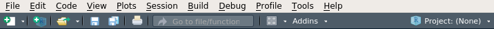
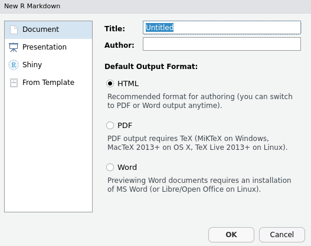
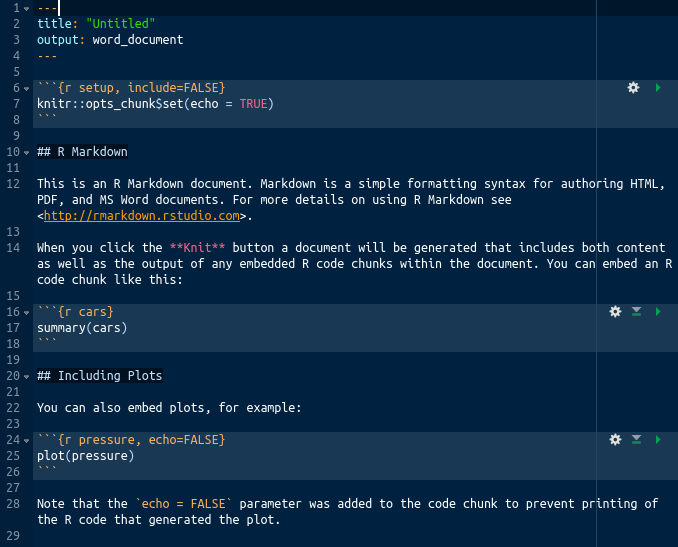
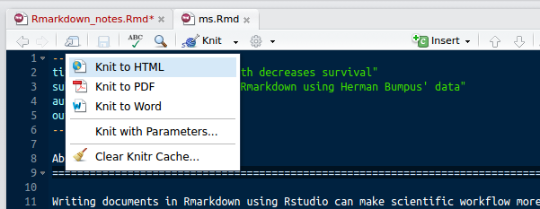

Contents
================================================================================

********************************************************************************

**Note: Please think of this document as a living document, which anyone is free to improve (like a [wiki](https://en.wikipedia.org/wiki/Wiki)) with minor edits, new sections that others might find useful, or [additional resources](#whatelse) that might be helpful. After reading through this, readers should be able to start writing manuscripts in Rmarkdown, integrating references using [BibTeX](https://en.wikipedia.org/wiki/BibTeX), analyses with R, and equations through [LaTeX](https://en.wikipedia.org/wiki/LaTeX) code if need be. The objective is not to make the reader an expert at Rmarkdown, but to give the reader the confidence to start writing in Rmarkdown and motivation to do so when starting any new document**

********************************************************************************

- [Introduction to Rmarkdown](#what_is_rmd)
- [Practical differences between Rmarkdown and Word](#practical_diffs)
- Writing a manuscript in Rstudio
    - [Writing an abstract in Rstudio (the basics)](#abstract)
    - [Writing an introduction in Rstudio (citations)](#intro)
    - [Writing methods in Rstudio (images & equations)](#methods)
    - [Writing results in Rstudio (integrating R)](#results)
    - [Writing a Discussion in Rstudio (final tips)](#discussion)
    - [Writing an Appendix in Rstudio (tables)](#appendix)
- [Adding page headers](#headers)
- [Concluding remarks](#conclusion)

********************************************************************************

<a name="what_is_rmd">Introduction to Rmarkdown</a>
================================================================================

Rmarkdown is a type of file (extension '.Rmd') that is used to make documents that are easily integrated with R. Within [Rstudio](https://www.rstudio.com/), a document can be written in Rmarkdown, then converted seamlessly to high quality HTML, PDF, or DOCX formats. Because Rmarkdown files are [text files](https://en.wikipedia.org/wiki/Text_file), they can be viewed and edited in [any text editor](https://en.wikipedia.org/wiki/List_of_text_editors) (e.g., Notepad, gedit) or [integrated development environment](https://en.wikipedia.org/wiki/Integrated_development_environment) (e.g., Rstudio, vim, emacs). Text files are also easy to work with in [version control](https://stirlingcodingclub.github.io/version_control/vc_notes.html) and on [GitHub](https://github.com/) because version control (e.g., git) can track the line by line changes over time in a way that cannot be done with non text files (i.e., [binary](https://en.wikipedia.org/wiki/Binary_file) files). Other examples of text files are files with the extensions .txt, .R, .c, .csv, .md, .html, and .xml; binary files include files with the extensions .jpg, .mp3, .doc, .ppt, and .exe (note that .docx or .xlsx files are zipped .xml files, so something with these extensions cannot be opened in a text editor, but is not technically a binary). For now, **all that is important to know is that .Rmd files can be opened and edited in Rstudio, and turned into HTML, PDF, or DOCX files with the push of a button**.

Getting started with writing simple documents in Rmarkdown takes very little time in Rstudio. In fact, when initialising a new Rmarkdown document within Rstudio (in Rstudio, select `File > New File > R Markdown`), some example text and R code is initialised to help demonstrated how it works; this sample text can be immediately turned into an HTML, PDF, or DOCX using the 'Knit' icon in the Rmarkdown toolbar.

<br>
<center>

</center>
<br>

It is not immediately obvious what the advantage is for doing any of this, particularly for people who are already comfortable writing in Word (or LaTeX). My hope is that the advantages will become clear as I demonstrate how to write a manuscript in Rmarkdown. Some of these advantages will be obvious features of Rmarkdown, including the ability to do the following: integrate R code directly (avoiding the need to awkwardly copy-paste analyses, tables, or figures), use BibTeX (to easily add citations, properly formatted for a specific journal), integrate LaTeX equations, add links, and add HTML code and comments.  Other advantages will be more subtle, and include the ability to integrate more easily with version control software such as git, and to focus more clearly on the process of writing rather than formatting the document. I will explain this latter advantage in more detail in the next section, comparing how writing in Rmarkdown differs from writing in Word, in practice.

Rmarkdown is still fairly new, having been first released in 2012 [@Xie2018], not long after the initial release of Rstudio in 2011. The ability to write high quality documents in Rmarkdown is possible because of the work of the [Rstudio team](https://www.rstudio.com/about/), and especially the developer [Yihui Xie](https://yihui.name/). Before this, the options were pretty much limited to Microsoft Word and LaTeX. Having written manuscripts in all three, I am convinced that Rmarkdown is the most useful and most efficient way to do scientific writing. The essential tools for getting started can be learned in minutes, with the more advanced options being learned along the way fairly painlessly as needed.

<a name="practical_diffs">Practical differences between Rmarkdown and Word</a>
================================================================================

Most biologists write manuscripts in Miscrosoft Word. There is nothing wrong with this, but Microsoft Word and other word processors are not written with scientific writing in mind. And the prevalence of word processors makes the inconveniences associated with using them to do scientific writing go largely unrecognised; we are used to it. Page breaks and formatting can be difficult to specify as desired. Figures need to be copied and pasted into the text (or attached separately). Table elements from statistical output often need to be copied and pasted, or written from scratch. Within-text values calculated from data need to likewise be copied into Word directly. All of this takes time, and these processes need to be repeated if something in the analysis changes affecting figures, tables, or summary statistics. **In the long-term, the biggest practical difference between writing in Rmarkdown versus Word is to greatly increase the efficiency from data to professional looking output.**

**In the short-term, however, the biggest practical difference between Rmarkdown and Word is the writing environment**. It is easy to see what the output of a Word document is going to look like while it is being written; [what you see is what you get (WYSIWYG)](https://en.wikipedia.org/wiki/WYSIWYG). In Rmarkdown, this is not the case. Writing is done in plain text, and the final output looks different from how the content looks while it is being written. In this way, writing in Rmarkdown is more similar to writing in [LaTeX](https://en.wikipedia.org/wiki/LaTeX), another plain text writing tool that can produce nice looking [PDF outputs](https://www.biorxiv.org/content/biorxiv/early/2017/09/24/136093.full.pdf), but has a [high learning curve](https://github.com/bradduthie/pre_post_cop/blob/master/pre_post_biorxiv.tex) to use effectively. The separation between plain text writing and final output can be a bit intimidating at first, or at least a bit unintuitive, but there are many practical reasons for it. Having everything assembled at once and only when desired means that key processes (e.g., paragraph formatting, text spacing, addition of references, etc.) do not need to be ongoing *during* the writing process, and this tends to make the organisation and type-setting of the final document look more professional. More subtley, it allows writers to separate the **content** of the writing from the **output**. If a formatting error occurs in Word (e.g., tabs or a figure are out of place), then it immediately disrupts the thought process of writing; by isolating the written content from how it looks in the output, such disruptions do not occur. Nevertheless, getting used to this type of workflow takes some time. 

In the next section, I will ease the reader into this work flow by introducing the Rstudio environment for writing in Rmarkdown, demonstrate a simple example of how Rmarkdown can be used to write a manuscipt abstract, then 'knit' this abstract into an HTML, PDF, or DOCX output.

<a name="abstract">Writing an abstract in Rstudio (the basics)</a>
================================================================================

After opening Rstudio, the option to create a new Rmarkdown file can be accessed by navigating to 'File', scrolling down to 'New File', then selecting 'R Markdown...'. Alternatively, it can be accessed by selecting the icon directly below 'File' (see below) and choosing 'R Markdown...'. 

<br>
<center>

</center>
<br>

In either case, a box will pop up that looks like the one below, which asks for a title and author. It will also ask for a default output format, but this really is not important to specify; all will be possible and easy to choose regardless of the default selected.

<br>
<center>

</center>
<br>

In addition to writing an Rmarkdown document, the options on the left also allow for writing a presentation or [shiny](https://shiny.rstudio.com/) document in Rmarkdown. I will not discuss how to do this in the current document, but a general understanding of Rmarkdown will make creating slides and shiny presentations much easier. After clicking 'OK', Rstudio will create a new Rmarkdown document, complete with some sample text that looks something like the below (the colour scheme might differ, of course).

<br>
<center>

</center>
<br>

This code is demonstrating some of the features of Rmarkdown, including the integration of R code directly into the document. Seeing the output of this is possible by simply clicking the 'Knit' button in the tool bar, as shown below.

<br>
<center>

</center>
<br>

Clicking the 'Knit' button will produce an HTML (or PDF or DOCX) with the R analysis run as written in the code; the output should appear when finished in whatever format has been requested. If there are package missing that are needed to knit everything properly, Rstudio will ask to install these first. This simple starting example provides a flavour of what Rmarkdown is capable of doing, but I want to instead start from scratch and focus on process of writing an abstract. I will therefore remove everything after line 5 above until the Rmd file looks like the below.

```{YAML}
---
title: "Untitled"
output: html_document
---
    
```

The text between the top and bottom `---` dashes is a [YAML header](https://en.wikipedia.org/wiki/YAML) header (YAML stands for 'Yet Another Markup Language'). It is not important to understand YAML or know how this header works; it is actually entirely optional. But keeping it in place is helpful, and as I continue to write my example manuscript, I will add to it to show some useful tricks. The first such trick will be to add a title, subtitle and author, which is shown below.

```{YAML}
---
title: "High sparrow body length decreases survival"
subtitle: "A demonstration of Rmarkdown using Herman Bumpus' data"
author: Brad Duthie
output: html_document
---
    
```

Essentially, the YAML header allows authors to specify key information to be used when producing the final document (i.e., meta data). I will now move onto the Rmarkdown text itself, starting with the abstract title and the abstract itself. Directly below the YAML header, I will add the text below.

```
---
title: "High sparrow body length decreases survival"
subtitle: "A demonstration of Rmarkdown using Herman Bumpus' data"
author: Brad Duthie
output: html_document
---
    
Abstract
===============================================================================
  
Writing documents in Rmarkdown using Rstudio can make scientific workflow more efficient, and here I demonstrate how a scientific manuscript can be written using a classical data set first published by Herman Bumpus. I integrate Bumpus' data with Rmarkdown to produce a sample manuscript, testing whether or not sparrow body length decreases survival following a storm in southern New England. Using a t-test, I show that surviving birds have lower body length than birds that do not survive. All analyses of data are incorporated into the underlying Rmarkdown document, including figures and a table. References are incorporated using BibTeX. The underlying code for this manuscript is publicly available [on GitHub](https://github.com/StirlingCodingClub/Manuscripts_in_Rmarkdown) as part of the Stirling Coding Club organisation.
```

Two things are worth pointing out in the code above. First, the extended `===` underneath the word 'Abstract'; this tells Rmarkdown to create a title in the output. Second, the words 'on GitHub' make a link to the Stirling Coding Club website; the square brackets indicate the words to appear linked `[on GitHub]`, while the parentheses that immediately follow specify the URL. Both of these tools are available in basic markdown too (i.e., .md files). 

We can take a quick break here and see what the output of the document looks like as an HTML file. I have saved the file above as 'ms.Rmd', and we can see the output by clicking the 'Knit' button in the Rstudio toolbar.

<br>
<center>

</center>
<br>

[Here](https://stirlingcodingclub.github.io/Manuscripts_in_Rmarkdown/ms_history/ms_abstract.html) is what the output looks like in HTML. The title, subtitle, and author have been included, the abstract is recognised as a title, and the link is included appropriately. Of course, in most cases, the output of a manuscrpit would be much better as a PDF or DOCX than an HTML file. To instead get a PDF, it is easy to simply select the pull down from the 'Knit' button and choose 'PDF' instead of 'HTML'. 

<br>
<center>

</center>
<br>

Rstudio immediately starts to produce a file 'ms.pdf' instead of 'ms.html', and adjust the YAML header of 'ms.Rmd' to include a PDF output, as shown below.

```{YAML}
---
title: "High sparrow body length decreases survival"
author: "Brad Duthie"
subtitle: A demonstration of Rmarkdown using Herman Bumpus' data
output:
  pdf_document: default
  html_document: default
---
```

Now there are two options available (`pdf_document` and `html_document`), and Rstudio has produced the same [manuscript file as a PDF](https://github.com/StirlingCodingClub/Manuscripts_in_Rmarkdown/blob/98457a6bbf0e51d4300fe8213159f775d2d75966/ms.pdf) rather than [an HTML](https://stirlingcodingclub.github.io/Manuscripts_in_Rmarkdown/ms_history/ms_abstract.html). Of course, many journals and colleagues prefer to read and receive manuscripts as DOCX files, so now is also a good time to use the knit pull-down menu and choose the 'Knit to Word' option to create a DOCX that can be opened and edited in Microsoft Word or some other word processor (e.g., [Libre Office](https://www.libreoffice.org/)). Again, Rmarkdown adjusts the YAML header to include a `word_document` in the output and produces a DOCX version of 'ms.Rmd'. 

Note that [the DOCX version](https://github.com/StirlingCodingClub/Manuscripts_in_Rmarkdown/raw/98457a6bbf0e51d4300fe8213159f775d2d75966/ms.docx) is formatted a bit strangely (clicking the link should start a download of the DOCX from GitHub), with titles coloured in light blue, which is not really desirable for scientific manuscripts. Other formatting issues leave a lot to be desired; the text is not double-spaced and there are no line or page numbers. To fix this, we could just edit these formatting options directly in Word, but this would be tedious because it would be necessary to repeat this every time a new DOCX was created using the knit function in Rstudio. Instead, **we can ensure that the created DOCX is formatted as desired every time by using a template DOCX**.  This template document is formatted in Word (or Libre Office) as desired, and Rstudio recognises these formats and uses them to create a new 'ms.docx'. [Here is an example of a template document](https://github.com/StirlingCodingClub/Manuscripts_in_Rmarkdown/raw/d15ea764d2f6c07c85ea82fc8207109f41844000/docx_template.docx) ('docx_template.docx') that I have created that is formatted in a way that is more useful for scientific manuscripts. To use it, the template document needs to be placed in the same folder as the manuscript file 'ms.Rmd', and we need to adjust the YAML header of 'ms.Rmd' as below.

```{YAML}
---
title: "High sparrow body length decreases survival"
author: "Brad Duthie"
subtitle: A demonstration of Rmarkdown using Herman Bumpus' data
output:
  word_document:
      reference_docx: docx_template.docx
  pdf_document: default
  html_document: default
---

```

Importantly, **the 'default' following 'word_document' above has been removed**. This tells Rmarkdown not to just go with the defaults for creating a DOCX file; the indented 'reference_docx' specifies to use 'docx_template.docx' as the template instead. With the above header and the [docx_template.docx](https://github.com/StirlingCodingClub/Manuscripts_in_Rmarkdown/raw/d15ea764d2f6c07c85ea82fc8207109f41844000/docx_template.docx) file in place, the end product is [a much nicer version of DOCX](https://github.com/StirlingCodingClub/Manuscripts_in_Rmarkdown/raw/d15ea764d2f6c07c85ea82fc8207109f41844000/ms.docx) for scientific writing. Of course, there is nothing special about the example template file that I have used, and any other DOCX should work if different formatting is desired. 

**Readers should now be able to produce a scientific abstract in HTML, PDF, and DOCX formats**. This is the core skill of using Rmarkdown for scientific writing; what follows are additional useful skills for making work flow easier and more efficient. Even if readers stop here, the above should give everything necessary for writing a document and tracking it with [version control](https://stirlingcodingclub.github.io/version_control/vc_notes.html), with figures, tables, etc. added into a DOCX directly if need be. Nevertheless, I encourage readers to continue beyond this point because the features that follow can make writing much easier, particularly through the integration of BibTeX and R code. In the next section, I will write a brief introduction to 'ms.Rmd', and the primary Rmarkdown focus will be making the inclusion of citations efficient through the integration of BibTeX.

<a name="intro">Writing an introduction in Rstudio (citations)</a>
================================================================================

In writing the introduction, I will focus specifically on incorporating citations using BibTeX. Doing this is not strictly necessary, of course, and parenthetical citations and references could be typed in as normal text, as shown below

```
Introduction
================================================================================

In the late 1800s, there was a particulalry severe snowstorm in Providence, Rhode Island. At the time, Herman Bumpus was a professor of comparative zoology at Brown University. Bumpus noticed that the storm had a particularly negative effect on the local sparrow population (*Passer domesticus*) and decided to use the event to test Charle's Darwin's theory of natural selection (Darwin 1959). Bumpus collected 136 sparrows; some of these sparrows survived the storm, while others perished. Bumpus published a paper and all of the data that he had collected (Bumpus 1989). These data are now a classic data set in biology, and have been analysed multiple times (e.g., Johnston et al. 1972). Here I will use Bumpus' data to demonstrate how to write a scientific manuscript in Rmarkdown.

The focus of this manuscript is therefore not on Bumpus' data or survival of sparrows *per se*, but the process of scientific writing using Rmarkdown. I have chosen the Bumpus data set because it provides a useful tool for working through most key features of Rmarkdown that scientists might want to use when writing a manuscript. The example question that I will address through this data set and R analysis in Rmarkdown is whether or not increasing sparrow body length is associated with decreased survival following a storm.
```

As a side note, the asterisks around 'per se' in the first sentence of the second paragraph above causes the words to appear in italics in the output (bold can be created with either two italics, `**per se**` or underlines, `_per se_`). Given the above citations, I could then attach a bibliography on the end with all three included manually, as below.

```
References
===============================================================================

Bumpus, H. C. (1898). Eleventh lecture. The elimination of the unfit as illustrated by the introduced sparrow, *Passer domesticus*. (A fourth contribution to the study of variation.). Biological Lectures: Woods Hole Marine Biological Laboratory, 209–225.

Darwin, C. (1859). The Origin of Species. New York: Penguin.

Johnston, R. F., Niles, D. M., & Rohwer, S. A. (1972). Hermon Bumpus and natural selection in the House Sparrow *Passer domesticus*. Evolution, 26, 20–31.
```

Adding the above sections to the document 'ms.Rmd' and using knit to make document such as [this HTML](https://stirlingcodingclub.github.io/Manuscripts_in_Rmarkdown/ms_history/ms_intro.html) works fine (see the [PDF](https://github.com/StirlingCodingClub/Manuscripts_in_Rmarkdown/blob/551d51f3cccadc2b17bb9cea74c9f72569d2e68d/ms.pdf) or [DOCX](https://github.com/StirlingCodingClub/Manuscripts_in_Rmarkdown/raw/551d51f3cccadc2b17bb9cea74c9f72569d2e68d/ms.docx) here). Manually adding references becomes time consuming, however, and it would be more efficient to get Rstudio to do all of the referencing for us instead. **Below, I will demonstrate how do to everything above using BibTeX**.

The idea of using BibTeX is to avoid having to manually format references, and instead type in a unique 'key' whenever a references is cited. In addition to **automatically building the reference section** of a manuscript, using BibTeX can allow authors to change reference styles without having to manually reformat anything (e.g., if a manuscript needs to be submitted to a different journal). **Here is how it works**; a separate text file with the extensions '.bib' is created with all of the information needed to produce a bibliography. For the three references used above, this BIB file would look like the below (I have removed an extra set of brackets around the titles below, which are usually needed but cause a page build failure in GitHub).

```
@article{Bumpus1898,
author = {Bumpus, Hermon C},
journal = {Biological Lectures: Woods Hole Marine Biological Laboratory},
pages = {209--225},
title = {Eleventh lecture. The elimination of the unfit as illustrated by the introduced sparrow, {\it Passer domesticus}. (A fourth contribution to the study of variation.)},
year = {1898}
}
@book{Darwin1859,
address = {New York},
author = {Darwin, Charles},
pages = {495},
publisher = {Penguin},
title = {The Origin of Species},
year = {1859}
}
@article{Johnston1972,
author = {Johnston, R F and Niles, D M and Rohwer, S A},
journal = {Evolution},
pages = {20--31},
title = {Hermon Bumpus and natural selection in the House Sparrow {\it Passer domesticus}},
volume = {26},
year = {1972}
}
```

The '@' in the above specifies the type of reference used, and key for each reference is located after the opening `{` bracket (e.g., the first key is `Bumpus1989` -- note that keys are case sensitive; it matters which letters are upper versus lower case). Remaining tags (e.g., title, year, author) are specified within the outer brackets. I can put all of the key information above into the BIB file manually and save the above to its own file [refs.bib](). Some [helpful hints](https://www.openoffice.org/bibliographic/bibtex-defs.html) for different BibTeX tags can be found online, but I have tried to include most of the obvious ones for books and articles above. **Note that some reference managers will create BibTeX files automatically, greatly speeding up the process.** For example, to create a BIB file in [Mendeley](https://www.mendeley.com/?interaction_required=true) (which is [free to download](https://www.mendeley.com/download-desktop/)), highlight all the documents in Mendeley to be included, then go to 'File > Export'; Mendeley will open a prompt to save as a BIB file, and this file should be saved in the same directory as the manuscript. Because I am lazy with this, I tend to simply highlight all of the documents in my Mendeley desktop and export them wherever I need to -- this creates a BIB file with thousands of entries, but those not used in a document will simply be ignored. 

As a side note, unfortunately, BIB files use LaTeX code rather than Rmarkdown to format text. The only place where this is likely to become important is when words in the BIB file need to be italicised (e.g., scientific names). I have shown how to do that above in two of the titles; see `{\it Passer domesticus}`. 

Now that I have created the [refs.bib](https://github.com/StirlingCodingClub/Manuscripts_in_Rmarkdown/blob/master/refs.bib) BibTeX file, I need to tell the ms.Rmd file to use it to build references, then replace manually added parenthetical citations with citation keys. To do this requires an addition to the YAML header of ms.Rmd, which now looks like the below.

```{YAML}
---
title: "High sparrow body length decreases survival"
author: "Brad Duthie"
subtitle: A demonstration of Rmarkdown using Herman Bumpus' data
output:
  word_document:
    reference_docx: docx_template.docx
  pdf_document: default
  html_document: default
bibliography: refs.bib
---
```

All that has been added is the line `bibliography: refs.bib`.  This tells ms.Rmd where the reference information is located. I can now create the same document as before using BibTeX by inserting the correct citation keys, so this is what ms.Rmd looks like now.

```
---
title: "High sparrow body length decreases survival"
author: "Brad Duthie"
subtitle: A demonstration of Rmarkdown using Herman Bumpus' data
output:
  word_document:
    reference_docx: docx_template.docx
  pdf_document: default
  html_document: default
bibliography: refs.bib
---
    
Abstract
===============================================================================
  
Writing documents in Rmarkdown using Rstudio can make scientific workflow more efficient, and here I demonstrate how a scientific manuscript can be written using a classical data set first published by Herman Bumpus. I integrate Bumpus' data with Rmarkdown to produce a sample manuscript, testing whether or not sparrow body length decreases survival following a storm in southern New England. Using a t-test, I show that surviving birds have lower body length than birds that do not survive. All analyses of data are incorporated into the underlying Rmarkdown document, including figures and a table. References are incorporated using BibTeX. The underlying code for this manuscript is publicly available [on GitHub](https://github.com/StirlingCodingClub/Manuscripts_in_Rmarkdown) as part of the Stirling Coding Club organisation.

Introduction
================================================================================

In the late 1800s, there was a particulalry severe snowstorm in Providence, Rhode Island. At the time, Herman Bumpus was a professor of comparative zoology at Brown University. Bumpus noticed that the storm had a particularly negative effect on the local sparrow population (*Passer domesticus*) and decided to use the event to test Charle's Darwin's theory of natural selection [@Darwin1859]. Bumpus collected 136 sparrows; some of these sparrows survived the storm, while others perished. Bumpus published a paper and all of the data that he had collected [@Bumpus1898]. These data are now a classic data set in biology, and have been analysed multiple times [e.g., @Johnston1972]. Here I will use Bumpus' data to demonstrate how to write a scientific manuscript in Rmarkdown.

The focus of this manuscript is therefore not on Bumpus' data or survival of sparrows *per se*, but the process of scientific writing using Rmarkdown. I have chosen the Bumpus data set because it provides a useful tool for working through most key features of Rmarkdown that scientists might want to use when writing a manuscript. The example question that I will address through this data set and R analysis in Rmarkdown is whether or not increasing sparrow body length is associated with decreased survival following a storm.

References
===============================================================================
```

There are two things to note here. First, the manually written parenthetical citations (e.g., 'Darwin 1859') have been replaced with the appropriate citations keys wrapped in square brackets (e.g., '`[@Darwin1959]`'). BibTeX knows to link these with the appropriate reference information and add them as parenthetical citations; leading words can be added, as in the case of '`[e.g., @Johnston1972]`'. To cite the authors' names and just place the year in a parenthetical, we can change the below,

```
Bumpus published a paper and all of the data that he had collected [@Bumpus1898].
```

And we can instead write,

```
@Bumpus1898 published a paper and all of the data that he had collected [@Bumpus1898].
```

I have changed this in the text of ms.Rmd to demonstrate it.

Second, I have removed the references that were originally manually included in the Rmd file. This is because BibTeX adds them automatically at the end of the document, so writing them ourselves is not required.

**A few more fancy tricks.** It might be useful to include linked citations and specific formatting for the literature cited. To do the former, the lines `link-citations: yes` and
`linkcolor: blue` (or whatever colour is preferred) should be added to the YAML header; parenthetical citation will then be linked to the associated entry in the bibliography. To do the latter requires a [Citation Style Language (CSL)](https://en.wikipedia.org/wiki/Citation_Style_Language) text file to be included in the same directory as ms.Rmd. Often it is easy to search online for CSL files for a particular scientific journal (a lot of them are [available on GitHub](https://github.com/citation-style-language/styles)). For example, I have downloaded and included the appropriate CSL files for *Nature* and *Evolution*, both of which are available for download [here](https://github.com/citation-style-language/styles). **It is not important to know how CSL files work** -- they are essentially text files that tell the Rmarkdown file how to use the information in the BibTeX file to build the citations. But this is done automatically by adding a line to the YAML index such as `csl: nature.csl`. The modified YAML header shows an Rmardown file that will produce linked citations in the style of *Nature*, including within-text citations as superscripts and bibliography of citations in the order in which tye appear within the text. [Here](https://stirlingcodingclub.github.io/Manuscripts_in_Rmarkdown/ms_history/ms_nature.html) is the resulting HTML. 

```{YAML}
---
title: "High sparrow body length decreases survival"
author: "Brad Duthie"
output:
  html_document: default
  pdf_document: default
  word_document:
    reference_docx: docx_template.docx
subtitle: A demonstration of Rmarkdown using Herman Bumpus' data
bibliography: refs.bib
link-citations: yes
linkcolor: blue
csl: nature.csl
---
```

If the manuscript is rejected from *Nature*, then reformatting all of the citations for a journal like *Evolution* is a trivially matter of just changing the CSL file above to, e.g., `csl: evolution.csl`. BibTeX will take care of the whole process automatically. **In summary, readers should now know how to link citations using the YAML header, and apply CSL scripts to easily convert from one reference type to another**. This can save a lot of time when needing to reformat manuscripts to fit particular journal formatting requirements. The current version of the [ms.Rmd manuscript](https://github.com/StirlingCodingClub/Manuscripts_in_Rmarkdown/blob/b011c8e680326b4afdfb4acb1f32cbddc87fc62b/ms.Rmd) can be now viewed in [PDF](https://github.com/StirlingCodingClub/Manuscripts_in_Rmarkdown/blob/b011c8e680326b4afdfb4acb1f32cbddc87fc62b/ms.pdf), [DOCX](https://github.com/StirlingCodingClub/Manuscripts_in_Rmarkdown/raw/b011c8e680326b4afdfb4acb1f32cbddc87fc62b/ms.docx), and [HTML](https://stirlingcodingclub.github.io/Manuscripts_in_Rmarkdown/ms_history/ms_evolution1.html) formats.

One last thing; eventually, readers might want to place there bibliographies some place other than the very end of the document file. For exmaple, if references need to come before figures, tables, or appendices. In this case, we can include the following line of code to force the references to a particular location.

```
References
================================================================================

<div id="refs"></div>

```

The `<div id="refs"></div>` locks the references wherever the should be placed. If a page break is desired after, it can be inserted on a new line by typing `\clearpage` (this obviously is not the case for HTML documents, which are not organised into pages). 

<a name="methods">Writing methods in Rstudio (images & equations)</a>
================================================================================

In writing the methods section, I want to focus specifically on the inclusion of images and equations into the text. Images are included using the code `` (the extension need not be JPG). No changes to the YAML header need to be made to do this. The first part of the Methods section will include a [public domain image of a sparrow](https://commons.wikimedia.org/wiki/File:Lto-tpbo-passer-domesticus-05.JPG).

```
Methods
================================================================================

Bumpus focused his study on the House Sparrow (*Passer domesticus*; see Figure 1), which has a very wide global distribution. It is native to Europe and Asia, but not the Americas where Bumpus collected his original study [@Bumpus1898]. In addition to measuring total length and survival for 136 sparrows, Bumpus measured sparrow sex, wingspan, and mass, and also the length of each sparrow's head, humerus, tibiotarsus, skull, and sternum. While modern ornithologists believe that the total body length measurement that I will use today is subject to high observational error [@Johnston1972], it will be more than sufficient for demonstrating Rmarkdown.

<!--- Note that the image below is in the public domain --->
<!--- https://commons.wikimedia.org/wiki/File:Lto-tpbo-passer-domesticus-05.JPG --->
<center>


</center>
```

In addition to the image inserted above, there are a couple additional things to note. First, the HTML script `<center>` is used, and other HTML scripts generally work with Rmarkdown (common ones that I use are `<br>` and `<hr>`). Second, notes can be written in the Rmarkdown file itself by enclosing as comments within `<!---` and `--->`. Anything that is put between them `<!--- like this --->` will not show up in the HTML, PDF, or DOCX output, so this can be used to write notes within Rmd (e.g., to comment on the text itself, as might be done using the comments feature in the margins of DOCX files in Word). 

Next, equations can be added to the text in the style of LaTeX. This feature is very useful because LaTeX produces highly professional looking equations, and these carry over to Rmarkdown. Learning the code to write these equations takes some time though, and at first requires a lot of [looking up code online](https://en.wikibooks.org/wiki/LaTeX/Mathematics). Below I include an example of what Rmarkdown can do with two key equations used in the Student's t-test.

```
I performed an independent two-sample student's t-test on sparrow total body length to test whether or not sparrows that died in the 1898 storm were larger than sparrows that survived. I assume that both groups of sparrows (dead and living) have equal variances, so the test statistic $t$ is calculated as follows,

$$t = \frac{\bar{X}_{1} - \bar{X}_{2}} {s_{p} \times \sqrt{\frac{1}{n_{1}} + \frac{1}{n_{2}}}}.$$

In the above, $\bar{X}_{1}$ and $\bar{X}_{2}$ are the mean of the samples of sparrows that died and lived, respectively. Similarly, $n_{1}$ and $n_{2}$ are the sample sizes of sparrows that died and lived, and $s_{p}$ is the pooled sample mean, which is calculated as follows,

$$s_{p} = \sqrt{\frac{s^{2}_{X_{1}} + s^{2}_{X_{2}}}{2}}.$$

In the above, the $s^{2}_{X_{1}}$ and $s^{2}_{X_{2}}$ are the sample standard deviations for sparrows that died and lived, respectively. I conduceted the two sample t-test using the `t.test` function in R [@R2018].
```

The equations are within the `$$` signs on a line of their own. Whenever an equation takes a line of its own, two `$$` encompass the equation. If an equation occurs within line, then only a single `$` is used  (e.g., `$e^{i \pi} + 1 = 0$` becomes $e^{i \pi} + 1 = 0$). The two equations shown above become,

$$t = \frac{\bar{X}_{1} - \bar{X}_{2}} {s_{p} \times \sqrt{\frac{1}{n_{1}} + \frac{1}{n_{2}}}},$$

and, 

$$s_{p} = \sqrt{\frac{s^{2}_{X_{1}} + s^{2}_{X_{2}}}{2}},$$

respectively. The whole methods are shown in context in the [HTML](https://stirlingcodingclub.github.io/Manuscripts_in_Rmarkdown/ms_history/ms_evolution2.html), [PDF](https://github.com/StirlingCodingClub/Manuscripts_in_Rmarkdown/blob/74c62583e36934b6400214a18bc9793932438fc3/ms.pdf), and [DOCX](https://github.com/StirlingCodingClub/Manuscripts_in_Rmarkdown/raw/74c62583e36934b6400214a18bc9793932438fc3/ms.docx) outputs. In the next section, I will finally get to explaining the integration of R within Rmarkdown.

<a name="results">Writing results in Rstudio (integrating R)</a>
================================================================================

In this section, we finally get to the integration of R into the Rmarkdown document. I will demonstrate how to load the data file `data/Bumpus_data.csv`, analyse the data, integrate key summary statistics into the body of the text, and present tables and figures made using R code. All of the data analysis can happen in the background of the Rmarkdown document, with the text output displaying only what is desired. This is done by calling R directly in the Results section of ms.Rmd as follows. Note that in the below, to avoid confusing Rmarkdown, I have replaced all [grave accents](https://en.wikipedia.org/wiki/Grave_accent) ($`$ and $```$) with [apostrophes](https://en.wikipedia.org/wiki/Apostrophe) ($'$ and $'''$) .

```
Results
===============================================================================

'''{r, echo = FALSE, eval = TRUE}
dat  <- read.csv(file = "data/Bumpus_data.csv");
res  <- t.test(formula = dat$totlen ~ dat$surv, alternative = "less", 
               var.equal = TRUE); # Two sample t-test results
tval <- as.numeric(res$statistic); # Get the t-test statistic
pval <- res$p.value; # Get the p value from the t-test results
live <- as.numeric(res$estimate[1]); # Get mean length of living sparrows
dead <- as.numeric(res$estimate[2]); # Get mean length of dying sparrows
'''

Bumpus' data included 'r sum(dat$surv == "alive")' sparrows that lived and 'r sum(dat$surv == "dead")' sparrows that died. The mean total length of living sparrows was 'r round(live, digits = 2)' mm, and the mean total length of dead sparrows was 'r round(dead, digits = 2)' mm. The two sample t-test revealed a t-statistic of 'r round(tval, digits = 2)', which corresponds to a p-value of $P =$ 'r round(pval, digits = 5)'. 
```

```{r, echo = FALSE, eval = TRUE}
dat  <- read.csv(file = "data/Bumpus_data.csv");
res  <- t.test(formula = dat$totlen ~ dat$surv, alternative = "less", 
               var.equal = TRUE); # Two sample t-test results
tval <- as.numeric(res$statistic); # Get the t-test statistic
pval <- res$p.value; # Get the p value from the t-test results
live <- as.numeric(res$estimate[1]); # Get mean length of living sparrows
dead <- as.numeric(res$estimate[2]); # Get mean length of dying sparrows
```

In the above the `echo = FALSE` option in `{r, echo = FALSE}` tells R not to print any of the code that follows. It will, however *evaluate* the code in R (to have it not evaluate, set `eval = FALSE`). Hence, the results of the data analysis in `res` and the variables pulled from `res` (`tval`, `pval`, `live`, and `dead` in the above) can be used and printed out as desired. This is what is being done in the paragraph that follows. Hence when I write 'r sum(dat$surv == "alive")' (but with grave accents rather than the apostrophes I just used), R calculates the total sum of surviving sparrows just as it would in the normal R console. The leading 'r' tells Rmarkdown to evaluate everything between the grave accents, then print it as plain text; in this case the value `r sum(dat$surv == "alive")`. All of the code in the short paragraph above ultimately produces text that looks like the below.

> Bumpus' data included `r sum(dat$surv == "alive")` sparrows that lived and `r sum(dat$surv == "dead")` sparrows that died. The mean total length of living sparrows was `r round(live, digits = 2)` mm, and the mean total length of dead sparrows was `r round(dead, digits = 2)` mm. The two sample t-test revealed a t-statistic of `r round(tval, digits = 2)`, which corresponds to a p-value of $P =$ `r round(pval, digits = 5)`.

This can be seen more clearly in the Results section of [ms.Rmd](https://github.com/StirlingCodingClub/Manuscripts_in_Rmarkdown/blob/master/ms.Rmd). Note that this is only a greatly simplified example; it is entirely possible to do much more complex analyses, including reading in multiple packages, from within Rmarkdown. It is also easy to **embed figures directly into Rmarkdown documents** in the same way that they would be produced by the R console. In other words, there is no need to create an image file and then embed it as I did with the picture of the sparrow; Rmarkdown takes care of the image making directly from the R code.

```
'''{r, echo = FALSE, eval = TRUE, fig.width = 5, fig.height = 5, fig.cap = "Box plot of the total lengths of live and dead sparrows following a snowstorm in Providence, RI, as originally collected by Hermon Bumpus. The central horizontal line shows median values. Boxes and whiskers show inter-quartile ranges and extreme values, respectively."}
par(mar = c(5, 5, 1, 1));
plot(x = dat$surv, y = dat$totlen, cex.axis = 1.5, lwd = 2,
     ylab = "Total Sparrow Length (mm)", cex.lab = 1.5);
'''
```

The option `echo = FALSE` in this case tells Rmarkdown not to print the code itself in the document; only the figure will be printed below. More options for using coding chunks in Rmarkdown (e.g., whether or not to display error messages) can be found at the University of Edinburgh [Coding Club Website](https://ourcodingclub.github.io/2016/11/24/rmarkdown-1.html#insert). The fig height and width can be specified as above, and the figure caption appears below the figure itself, which looks like the below.

********************************************************************************

```{r, echo = FALSE, eval = TRUE, fig.width = 5, fig.height = 5, fig.cap = "Box plot of the total lengths of live and dead sparrows following a snowstorm in Providence, RI, as originally collected by Hermon Bumpus. The central horizontal line shows median values. Boxes and whiskers show inter-quartile ranges and extreme values, respectively."}
par(mar = c(5, 5, 1, 1));
plot(x = dat$surv, y = dat$totlen, cex.axis = 1.5, lwd = 2,
     ylab = "Total Sparrow Length (mm)", cex.lab = 1.5);
```

********************************************************************************

**It is important to note that Rmarkdown can only plot or print output that is read into the Rmd document itself**. In other words, if I had read `dat` into the the R *console* in Rstudio using `dat <- read.csv()`, but I had not input it using `dat <- read.csv()` into the Rmarkdown *document* above, then I would not have been able to plot `dat$surv` as above (or, indeed, use `dat` at all in the document). The Rmarkdown document and R console are independent within Rstudio.

A major benefit of using Rmarkdown to make figures rather than first saving them as an image file (e.g., JPG, PNG, etc.) is that if the data or analyses ever change, then the figure does not need to be remade and resaved. **Because the link from raw data to output is preserved seamlessly by Rmarkdown, any change to the data will result in updated result output and figures**. The manuscript as written up through the results can be viewed for [HTML](https://stirlingcodingclub.github.io/Manuscripts_in_Rmarkdown/ms_history/ms_results.html), [PDF](https://github.com/StirlingCodingClub/Manuscripts_in_Rmarkdown/blob/b2445dcf69d7c0f9c1f118c1695009644f6aeee6/ms.pdf), and [DOCX](https://github.com/StirlingCodingClub/Manuscripts_in_Rmarkdown/raw/b2445dcf69d7c0f9c1f118c1695009644f6aeee6/ms.docx) outputs. In the next section, I will finish the manuscript with a brief Discussion that will focus on some final tips for using Rmarkdown in writing a manuscript.

<a name="discussion">Writing a Discussion in Rstudio (final tips)</a>
================================================================================

There is not much more left to discuss, so I will wrap up with only a couple additional tips. Before going any further, I want to add a few things to the YAML header, which now looks like the below.

```
---
title: "High sparrow body length decreases survival"
author: "Brad Duthie"
date: Biological and Environmental Sciences, University of Stirling, Stirling, UK,
  FK9 4LA
output:
  pdf_document: default
  html_document: default
  word_document:
    reference_docx: docx_template.docx
header-includes:
- \usepackage{lineno}
- \linenumbers
linestretch: 2
link-citations: yes
linkcolor: blue
csl: evolution.csl
subtitle: A demonstration of Rmarkdown using Herman Bumpus' data
bibliography: refs.bib
---
```

Now, I have added my address in the `date` field of the YAML header. Unfortunately, this is a workaround for getting it to print to the output; Rmarkdown does not recognise any other field that will work, so `date` needs to be used to get address information below the title or subtitle. I have also added the field `linestretch: 2` to the YAML header, which tells Rmarkdown to double-space the PDF document output. Because colleagues and scientific journals typically want lines to be numbered, it is also necessary to add the `header-includes:` field to the YAML header. What this field is doing is telling Rmarkdown to use LaTeX packages (in this case, the `lineno` package) when making the PDF through `-usepackage{lineno}`, and then add line numbers with `-linenumbers`. The ability to do this requires that [the lineno package](https://ctan.org/pkg/lineno?lang=en) be downloaded first. 

I have chosen to keep the Discussion text itself quite brief. The code below includes all of the text.

```
Discussion
================================================================================

I have analysed data collected by Herman Bumpus [@Bumpus1898] on the relationship between sparrow (*Passer domesticus*) total length and surival following an unusually severe storm. I found that sparrows that died in the storm were longer than sparrows that survived, which suggests that higher sparrow body length decreased survival. Of course, it is not possible to definitively conclude a causal relationship between any aspect of body size and sparrow survival<!--- BD Note: maybe explain this better --->, and even the available data collected by Bumpus would permit a more thoughtful analysis than that conducted in this study (see [Appendix Table 1](#appendix)). 

<!---

Here is one way to add some more detailed comments into the manuscript itself, though this can also be done within the text (see above). 

--->

Overall, this document demonstrates how high quality, professional looking documents can be written using Rmarkdown. The [underlying code](https://github.com/StirlingCodingClub/Manuscripts_in_Rmarkdown/blob/master/ms.Rmd) for this manuscript is publicly available, along with [accompanying notes](https://stirlingcodingclub.github.io/Manuscripts_in_Rmarkdown/Rmarkdown_notes.html) to understand how it was written. By using Rmarkdown to write manuscripts, authors can more easily use version control (e.g., git) throughout the writing process. The ability to easily integrate citations though BibTeX, LaTeX tools, and dynamic R code can also make writing much more efficient and more enjoyable. Further, obtaining the benefits of using Rmarkdown does not need to come with the cost of isolating colleagues who prefer to work with Word or LaTeX because Rmarkdown can easily be converted to these formats (in the case of Word, with the push of a button). By learning all of the tools used in this manuscript, readers should have all of the necessary knowledge to get started writing and collaborating in Rmarkdown.
```

For the purpose of demonstration, I have included two notes within the Dicussion text as an example of the kinds of comments that might be made during the writing process (e.g., the equivalent of adding comments in a DOCX file). The code is the same as used in the [Methods](#methods) section, so my use here is really only for emphasis on the ability to use comments for multiple different purposes. I have also included a within-document link to an appendix `[Appendix Table 1](#appendix)`. This creates a link that redirects to the manuscript's Appendix Table 1, which I will discuss next.

<a name="appendix">Writing an Appendix in Rstudio (tables)</a>
================================================================================

Lastly, at the end of the [ms.Rmd](https://github.com/StirlingCodingClub/Manuscripts_in_Rmarkdown/blob/master/ms.Rmd) document, I have added an appendix with the code below.

```
<a name="appendix">Appendix Table 1</a>
================================================================================

An example table is shown below, which includes all of the variables collected by @Bumpus1898 for the first 10 measured sparrows. The full data set can be found online in [GitHub](https://github.com/StirlingCodingClub/Manuscripts_in_Rmarkdown/blob/master/data/Bumpus_data.csv).

'''{r, echo = FALSE}
library(knitr);
kable(x = dat[1:10,], caption = "First ten rows of the original data set collected by Hermon Bumpus");
'''
```

This appendix produced by the above code creates a table of the first 10 rows of Bumpus' data set. This is done using the `kable` funciton in the `knitr` R package, which must be called within Rmarkdown to work properly (the `knitr` package can be downloaded using the command `install.packages("knitr")`).

The final output is shown in [HTML](https://stirlingcodingclub.github.io/Manuscripts_in_Rmarkdown/ms_history/ms_final.html), [PDF](https://github.com/StirlingCodingClub/Manuscripts_in_Rmarkdown/blob/224e0f3673aece576d5c859f5409b6c9b68a5565/ms.pdf), and [DOCX](https://github.com/StirlingCodingClub/Manuscripts_in_Rmarkdown/raw/224e0f3673aece576d5c859f5409b6c9b68a5565/ms.docx) formats. Readers that can apply the code underlying this output in their own manuscripts should have all of the tools that they need to get started writing scientific manuscripts in Rmarkdown.

<a name="headers">Page headers</a>
================================================================================

When submitting a manuscript for review, many journals request that a header be added to the top of each page with a short title for the manuscript. Obviously, page headers are not applicable for HTML output, but they can be created in Rmarkdown for DOCX and PDF outputs. For DOCX files, the way to do this is by simply adding the desired header to the [template DOCX file](https://github.com/StirlingCodingClub/Manuscripts_in_Rmarkdown/blob/master/docx_template.docx). The header will be reproduced in the DOCX output to look exactly the same as it does in the template DOCX file.

For PDF output, the way to add a header is through the use of the '[fancyhdr](https://ctan.org/pkg/fancyhdr?lang=en)' LaTeX package. To get headers included into the PDF, the updated YAML header should add the following under 'header-includes'. 

```
header-includes:
- \usepackage{fancyhdr}
- \pagestyle{fancy}
- \fancyhead[L]{MANUSCRIPT AUTHORS}
- \fancyhead[R]{MANUSCRIPT SHORT TITLE}
```

With the above added to the YAML header of [ms.Rmd](https://github.com/StirlingCodingClub/Manuscripts_in_Rmarkdown/blob/master/ms.Rmd), the whole thing looks like the below.

```
---
title: "High sparrow body length decreases survival"
author: "Brad Duthie"
date: Biological and Environmental Sciences, University of Stirling, Stirling, UK,
  FK9 4LA
output:
  pdf_document: default
  html_document: default
  word_document:
    reference_docx: docx_template.docx
header-includes:
- \usepackage{fancyhdr}
- \pagestyle{fancy}
- \fancyhead[L]{MANUSCRIPT AUTHORS}
- \fancyhead[R]{MANUSCRIPT SHORT TITLE}
- \usepackage{lineno}
- \linenumbers
linestretch: 2
link-citations: yes
linkcolor: blue
csl: evolution.csl
subtitle: A demonstration of Rmarkdown using Herman Bumpus' data
bibliography: refs.bib
---
```

The above produces a [PDF](https://github.com/StirlingCodingClub/Manuscripts_in_Rmarkdown/blob/986fa429c88b1d5d1403005c265c6aaaa331a194/ms.pdf) and [DOCX](https://github.com/StirlingCodingClub/Manuscripts_in_Rmarkdown/raw/986fa429c88b1d5d1403005c265c6aaaa331a194/ms.docx) file with the appropriate headers included.


<a name="conclusion">Concluding remarks</a>
================================================================================

There are a few small notes to include in finishing up these notes. First, I want to re-emphasise that these notes are free to share and use, and that anyone is very welcome to fork the [GitHub Repository](https://github.com/StirlingCodingClub/Manuscripts_in_Rmarkdown) associated with these notes and use the file [ms.Rmd](https://github.com/StirlingCodingClub/Manuscripts_in_Rmarkdown/blob/master/ms.Rmd) as a template for writing their own manuscripts. Some of the techniques that I have presented in these notes are matters of my own organisational style, and should not necessarily be taken as required protocol; when in doubt, the best thing to do is experiment by changing the code and attempting to knit to see how the output changes as a result.

**Knowing how to write manuscripts in Rmarkdown will also make it easier to learn how to write slide presentations, and to start using [shiny](https://shiny.rstudio.com/).** Nearly all of the tricks that I have presented could just as easily be used in making HTML slide presentations, which is the way that I typically write presentations (see [here](https://github.com/StirlingCodingClub/version_control/blob/master/vc_presentation.Rmd) for the code underlying [some slides](https://stirlingcodingclub.github.io/version_control/vc_presentation.html#1) on version control).

Most readers will have collaborators who will prefer to work in Microsoft Word, and this should be relatively easy given the ability of Rmarkdown to create DOCX files as output. Less commonly, some collaborators, journals, or pre-print servers (e.g. [arXiv](https://arxiv.org/)) will require LaTeX files. [Here](https://gist.github.com/JJ/ef9d3d8f1142df064bd5) is a miniature how-to on how to create TEX files from Rmarkdown. Essentially, this requires an additional argument to the PDF output in the YAML header.

```{YAML}
output:
  pdf_document:
    keep_tex: true
```

The `keep_tex: true` keeps the intermediate TEX files, which can then be gathered to make the LaTeX document.

```
tar cvfz filename.tgz filename.tex filename_files
```

Lastly, I have focused specifically on how to get started writing manuscripts in Rmarkdown. My objective was to focus on what needs to be done rather than the details of how Rmarkdown works. Another excellent tutorial is available at the Edinburgh Coding Club's website [here](https://ourcodingclub.github.io/2016/11/24/rmarkdown-1.html). Rstudio also has its own introduction to Rmarkdown [here](https://rmarkdown.rstudio.com/) and [here](https://rmarkdown.rstudio.com/lesson-1.html), and [Yihui Xie](https://yihui.name/) has written an entire book on the subject that is [freely available online](https://bookdown.org/yihui/rmarkdown/). All of these are excellent resources for learning more about Rmarkdown.


Reference
=======================================================


